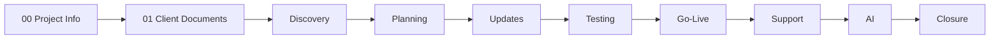
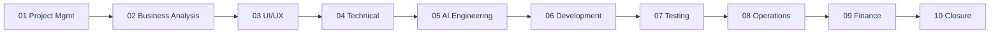

# Document Index — FTF AI Invoicing Agent

| Field | Value |
|---|---|
| **Project** | FTF – Survey Invoicing & Billing Delivery (E2E) |
| **Client** | NexGen Surveying / FieldToFinish (FTF) |
| **Prepared by** | Tisko Tech |
| **Project type** | AI Agent / AI OS |
| **Document** | Master Document Index |
| **Version** | 1.0 |
| **Owner** | Prateek Chandra (CTO) |
| **Status** | Draft for review |
| **Last updated** | 2026-07-16 |

---

## Purpose
This is the map of the **whole repository** — the **client** package (`01_Client_Documents`)
and the **internal** package (`02_Internal_Documents`). It tells you what each document is
for and where to find it. Start here.

## The package at a glance

## Documents in this package

| # | Folder | Document | What it answers |
|---|---|---|---|
| 1 | 00_Project_Information | **Project_Profile** | Who, what, why — the 1-page overview |
| 2 | 00_Project_Information | **Glossary** | Plain-English meaning of every term |
| 3 | 01_Client / 01_Discovery | **Business Discovery & Requirements** | The problem and what we agreed to build |
| 4 | 01_Client / 02_Planning | **Proposal, Solution & SOW** | The solution, scope, and what's in / out |
| 5 | 01_Client / 02_Planning | **Project Roadmap & Solution Blueprint** | The plan and how the system works |
| 6 | 01_Client / 03_Project_Updates | **Status & Milestone Report** | Where the project stands now |
| 7 | 01_Client / 04_Testing | **UAT & Client Acceptance** | How we prove it works + your sign-off |
| 8 | 01_Client / 05_Go_Live | **Go-Live Checklist & Handover** | How we went live and what you now own |
| 9 | 01_Client / 06_Support | **Support & Maintenance Guide** | How help works after go-live |
| 10 | 01_Client / 06_Support | **Training Guide & FAQ** | How your team uses the system day to day |
| 11 | 01_Client / 07_AI | **AI Solution Guide** | What the AI does, its limits, and safety |
| 12 | 01_Client / 07_AI | **AI Cost, Pricing & ROI** | What it costs to run and the return |
| 13 | 01_Client / 08_Project_Closure | **Closeout & Future Roadmap** | What was delivered + what's next |

## Internal package (`02_Internal_Documents`) — team-facing, not shared with the client

| # | Folder | Document | What it answers |
|---|---|---|---|
| 14 | 02 / 01_Project_Management | **Project Charter, RAID & Decisions** | Why, governance, risks, decisions, changes |
| 15 | 02 / 02_Business_Analysis | **Internal Requirements & Business Rules** | Full requirements, pricing rules, stories, use cases |
| 16 | 02 / 03_UI_UX | **UX, Interface & Flows** | Sheet / Teams / email surfaces + approver flow |
| 17 | 02 / 04_Technical | **Solution & Technical Architecture** | Components, data, integrations, infra, security |
| 18 | 02 / 05_AI_Engineering | **AI Engineering Guide** | Brain, prompts, guardrails, model, learning |
| 19 | 02 / 06_Development | **Development & Release Tracker** | Sprint, modules, builds, releases (git-reconciled) |
| 20 | 02 / 07_Testing | **Test Plan, Cases & Results** | Tests, regression, bugs, security/perf |
| 21 | 02 / 08_Operations | **Operations Runbook** | Deploy, monitor, incident, backup, DR, SOPs |
| 22 | 02 / 09_Finance | **Finance, Cost & Profitability** | Measured cost, margin, pricing, ROI (internal) |
| 23 | 02 / 10_Project_Closure | **Lessons Learned & Closeout** | Retrospective + internal sign-off |

> **Confidentiality:** the internal set contains implementation detail (architecture,
> prompts strategy, infra paths, margin/pricing) and is **not** shared with the client.
> Neither package contains secrets, API keys, passwords, or client PII.

## Reading order

- **Executives (client):** 1 → 4 → 6 → 12
- **Operations / approvers:** 10 → 11 → 9
- **Technical reviewers (internal):** 17 → 18 → 21
- **Delivery / PMO (internal):** 14 → 19 → 22 → 23

---
**Revision history**

| Version | Date | Author | Change |
|---|---|---|---|
| 1.0 | 2026-07-16 | Tisko Tech | Initial client package index |
| 1.1 | 2026-07-16 | Tisko Tech | Added internal package (10 docs) to the index |
| 1.2 | 2026-07-16 | Tisko Tech | Multi-agent verification pass vs code + **live prod server**. Confirmed cadence `*/15`, caps A1 100 / A2 30 / A3 30, cost math, 8 agents, 6621 commits/0 tags. Corrected script names (`ftf-invoicing-*.sh` → `run_server_*.sh`), the editable breakdown column (**col K**, not G), GHA-disabled deployment note, and per-order cost ($0.72). No secrets / no client-data leak. |
| 1.3 | 2026-07-17 | Tisko Tech | Cadence changed to **`*/5`** (every 5 min) across all docs. Added Col-F **Regrid locality map link** (opens the parcel locality, not global search) and the **synced sheet backup** (full workbook → server `backups/` + OneDrive copy with an org share link, every cycle). Sheet Guide→v16 / How-To→v9. |
