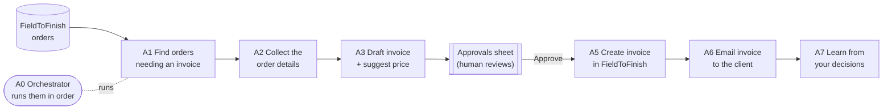

# Project Profile — FTF AI Invoicing Agent

| Field | Value |
|---|---|
| **Project** | FTF – Survey Invoicing & Billing Delivery (E2E) |
| **Client** | NexGen Surveying / FieldToFinish (FTF) |
| **Prepared by** | Tisko Tech |
| **Document** | Project Profile |
| **Version** | 1.0 · **Status** Draft for review · **Owner** Prateek Chandra (CTO) |
| **Last updated** | 2026-07-16 |

---

## 1. In one line
An **AI agent that prepares survey invoices automatically** and puts each one in
front of a person to approve — so billing is faster, consistent, and never sent
without a human "yes".

## 2. The problem it solves

| Before | After |
|---|---|
| Staff hand-price and hand-type every invoice | AI drafts the invoice with a suggested price |
| Easy to miss orders that need billing | AI scans FieldToFinish every 5 minutes |
| Pricing varies by person | AI uses the same rules + learns from your edits |
| No single view of what's waiting | One "Approvals" sheet shows everything |

## 3. What it is (project type)
An **AI Agent / AI OS** — a team of small AI workers (agents A0–A7) that run in
sequence, 24/7, with a human approval gate in the middle.

## 4. How it works (30-second view)

- **Nothing is sent without human approval.** The AI only drafts and suggests.
- The human works in **one Excel "Approvals" sheet** on OneDrive.
- A **twice-daily Teams report** (12 PM & 7 PM ET) shows what happened and who approved what.

## 5. Key facts

| Item | Detail |
|---|---|
| Build start | 2026-05-20 |
| Current phase | Live pilot on staging data, human-approval mode |
| Runtime | One production server, every 5 minutes, 24/7 |
| Human interface | OneDrive Excel "Approvals" tab (+ Teams report) |
| AI provider | Anthropic Claude (Opus / Sonnet / Haiku) |
| Core systems | FieldToFinish API + database, Microsoft 365 (Excel + Teams) |

## 6. People

| Role | Who |
|---|---|
| Client sponsor | Ryan (NexGen) |
| Business owner / domain | Robert (NexGen Surveying) |
| Product / CTO | Prateek Chandra |
| Operations / approver | Sumit Parik, Prateek Chandra |
| Delivery team | Tisko Tech (AI, engineering, QA, DevOps) |

> `[CLIENT INPUT REQUIRED]` — confirm the official client legal name, logo, and the
> final list of named approvers for the cover pages.

## 7. Current status (traffic light)

| Area | Status |
|---|---|
| Core pipeline (A0–A7) | 🟢 Built & running |
| Human approval flow | 🟢 Live (OneDrive sheet) |
| Monitoring / reporting | 🟢 Twice-daily Teams report |
| Production billing to real clients | 🟡 Gated — human-approval, staging-safe |

---
**Revision history**

| Version | Date | Author | Change |
|---|---|---|---|
| 1.0 | 2026-07-16 | Tisko Tech | Initial profile |
