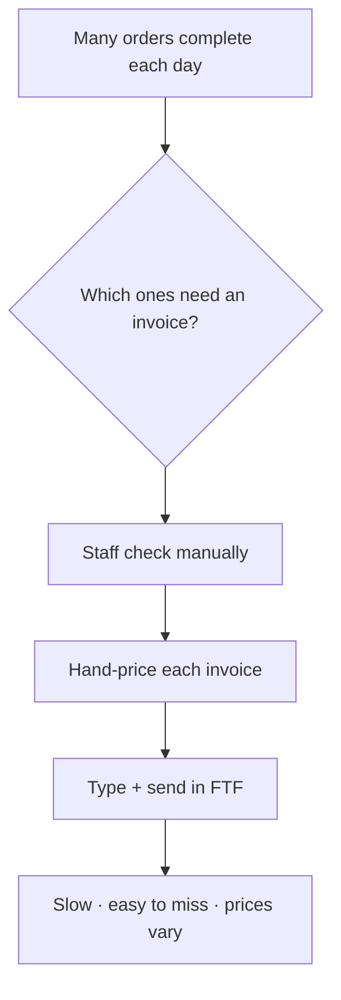

# Business Discovery & Requirements

| Field | Value |
|---|---|
| **Project** | FTF – Survey Invoicing & Billing Delivery (E2E) · **Client** NexGen Surveying / FTF |
| **Document** | Business Discovery & Requirements · **Version** 1.0 · **Status** Draft for review |
| **Prepared by** | Tisko Tech · **Owner** Prateek Chandra · **Updated** 2026-07-16 |

---

## Purpose
Explain the business problem and list, in plain language, what the system must do.

## Scope
Covers the **invoice / billing** part of the survey workflow: finding orders that
need a bill, drafting the invoice, human approval, creating it in FTF, and emailing
the client. Quoting/estimating and field scheduling are **out of scope** for this phase.

---

## 1. The business problem

**Pain points**
- Billing is manual and slow.
- Orders that need billing can be missed.
- Prices differ depending on who does them.
- No single place to see what is waiting.

## 2. Goals (what success looks like)

| # | Goal | Measure |
|---|---|---|
| G1 | Catch every order FTF flags for invoicing | 100% of flagged orders reach the sheet |
| G2 | Draft a priced invoice automatically | AI proposes price + line items |
| G3 | Keep a human in control | Nothing sent without approval |
| G4 | Make pricing consistent | Rules + learning from human edits |
| G5 | Give one clear view + daily reporting | Approvals sheet + 2 Teams reports/day |

## 3. Requirements

### 3.1 Functional (must do)

| ID | Requirement | Status |
|---|---|---|
| FR-1 | Scan FTF every 5 min for orders flagged `invoice_needed` | ✅ Delivered |
| FR-2 | Collect order details (address, size, county, flood zone, service) | ✅ Delivered |
| FR-3 | Draft invoice line items and suggest a price | ✅ Delivered |
| FR-4 | Detect condos, canceled, and delivered orders and flag them | ✅ Delivered |
| FR-5 | Post each draft to the OneDrive "Approvals" sheet | ✅ Delivered |
| FR-6 | Let a person Approve / Reject / Hold in the sheet | ✅ Delivered |
| FR-7 | Let a person edit the price/services before approving | ✅ Delivered |
| FR-8 | Create the invoice in FTF only after approval | ✅ Delivered |
| FR-9 | Email the invoice to the client | ✅ Delivered |
| FR-10 | Learn from human edits to improve future pricing | ✅ Delivered |
| FR-11 | Record who approved each order | ✅ Delivered |
| FR-12 | Twice-daily Teams report (activity + who did what) | ✅ Delivered |

### 3.2 Non-functional (how well)

| ID | Requirement | Target |
|---|---|---|
| NFR-1 | Safety: never send without human approval | Hard rule |
| NFR-2 | No duplicate invoices | Idempotency guard on every create |
| NFR-3 | Availability | 24/7, self-heals each run |
| NFR-4 | Traceability | Every action logged; approver captured |
| NFR-5 | Privacy | Client data stays in FTF + Microsoft 365 |

## 4. In scope vs out of scope

| ✅ In scope | ❌ Out of scope (this phase) |
|---|---|
| Invoicing flagged orders | Quotes / estimates |
| Human approval in Excel | Field crew scheduling |
| Pricing + learning | Marketing / win-back campaigns |
| Invoice email delivery | Website chat-to-order |

## 5. Key business rules
- The AI **only** brings orders FTF flags `ng_invoice_needed = 1`.
- Condo / airspace units cannot be surveyed → auto-flagged, not billed.
- Canceled or already-invoiced orders are never re-billed.
- Prices come from the Pricing Rules tab first, then AI reasoning, then human edit.

## 6. Assumptions & dependencies
- FTF reliably sets the `invoice_needed` flag when an order should be billed.
- Microsoft 365 (Excel + Teams) is available to the approvers.
- Anthropic Claude API is available for pricing/extraction.

> `[CLIENT INPUT REQUIRED]` — confirm whether unflagged, non-invoiced orders
> (e.g. quotes/in-progress) should ever be auto-surfaced. Today they are not, by design.

---
**Approval**

| Name | Role | Decision | Date |
|---|---|---|---|
|  | Client sponsor | ☐ Approve ☐ Changes |  |

**Revision history** — 1.0 (2026-07-16, Tisko Tech): initial.
