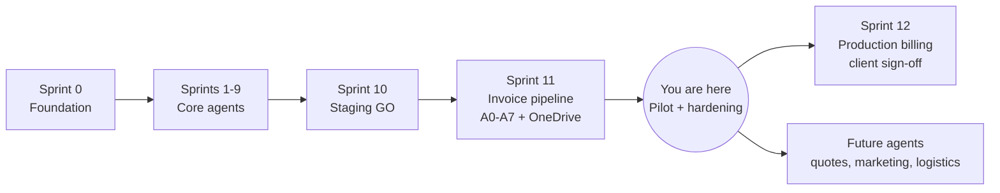
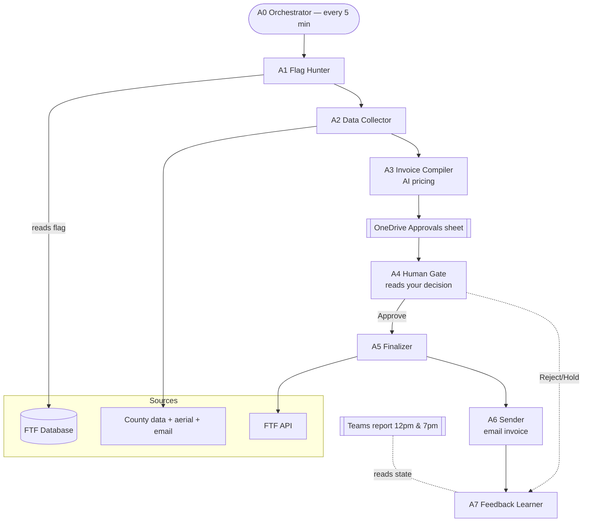
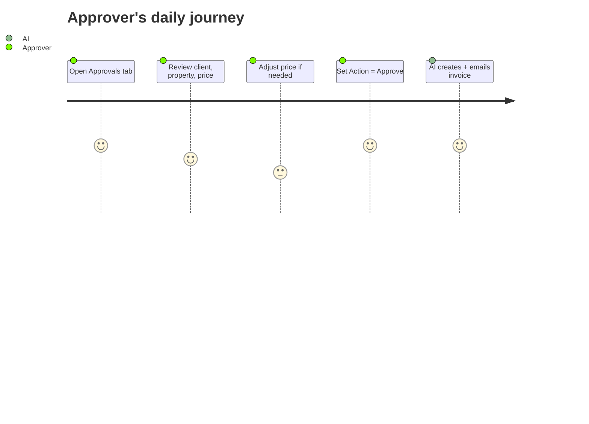

# Project Roadmap & Solution Blueprint

| Field | Value |
|---|---|
| **Project** | FTF – Survey Invoicing & Billing Delivery (E2E) · **Client** NexGen Surveying / FTF |
| **Document** | Roadmap & Solution Blueprint · **Version** 1.0 · **Status** Draft for review |
| **Prepared by** | Tisko Tech · **Owner** Prateek Chandra · **Updated** 2026-07-16 |

---

## Purpose
Show the delivery roadmap and how the solution is put together — enough for a
business or technical reader to understand the design without jargon.

## 1. Roadmap

| Phase | Outcome | Status |
|---|---|---|
| Sprint 0 | Repo, infra, DB, 5 API connections | ✅ Complete |
| Sprints 1–9 | Detection, pricing, human gate, delivery, memory | ✅ Complete |
| Sprint 10 | Full staging test — GO | ✅ Complete |
| Sprint 11 | 8-agent invoice pipeline + OneDrive approvals | ✅ Complete |
| **Now** | Pilot on staging data + hardening | 🟡 In progress |
| Sprint 12 | All loops live for real-client billing | ⬜ Pending client GO |
| Future | Quotes, marketing, logistics agents | ⬜ Backlog |

## 2. Solution blueprint (how it works)

## 3. What each agent does

| Agent | Job | Human involved? |
|---|---|---|
| **A0** | Runs the others in order, every 5 min | No |
| **A1** | Finds orders FTF flagged for invoicing | No |
| **A2** | Collects address, size, county, flood zone, service | No |
| **A3** | Drafts line items + suggests price; flags condos/canceled/delivered | No |
| **A4** | Reads Approve / Reject / Hold from the sheet | **Yes** |
| **A5** | Creates the invoice in FTF (after approval) | No |
| **A6** | Emails the invoice to the client | No |
| **A7** | Learns from your edits for next time | No |

## 4. The human touchpoint
The only place a person works is the **Approvals sheet**:

## 5. Technology (plain list)
- **AI:** Anthropic Claude (Opus / Sonnet / Haiku) for pricing and reading order data.
- **Human interface:** Microsoft 365 — Excel (OneDrive) + Teams.
- **Core system:** FieldToFinish API + database.
- **Runtime:** one always-on production server; timer every 5 minutes.

## 6. Safety & control (built in)
- No invoice is created or emailed without a human **Approve**.
- Duplicate-invoice guards on every create.
- Condo / canceled / delivered orders are flagged, not billed.
- Every action is logged; the approver's name is recorded.

---
**Revision history** — 1.0 (2026-07-16, Tisko Tech): initial.
