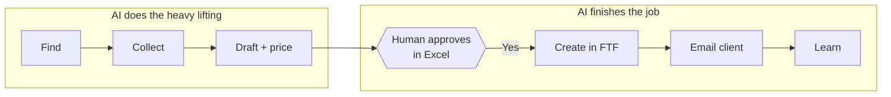
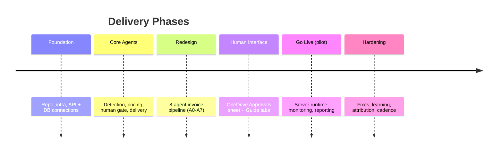

# Proposal, Solution & Statement of Work (SOW)

| Field | Value |
|---|---|
| **Project** | FTF – Survey Invoicing & Billing Delivery (E2E) · **Client** NexGen Surveying / FTF |
| **Document** | Proposal, Solution & SOW · **Version** 1.0 · **Status** Draft for review |
| **Prepared by** | Tisko Tech · **Owner** Prateek Chandra · **Updated** 2026-07-16 |

---

## Purpose
Describe the solution we proposed and built, and define the work scope, deliverables,
and boundaries in one place.

## 1. The solution in plain terms
A **human-supervised AI billing assistant**. It watches FieldToFinish, prepares each
invoice with a suggested price, and waits for a person to approve before anything is
created or emailed.

## 2. What you get (deliverables)

| # | Deliverable | Description |
|---|---|---|
| D1 | Invoice pipeline (A0–A7) | The full 8-agent automated workflow |
| D2 | Approvals sheet | One OneDrive Excel tab to review & approve |
| D3 | Pricing rules + learning | Consistent pricing that improves over time |
| D4 | Twice-daily Teams report | Activity + who approved what |
| D5 | Guide & How-To tabs | Built-in instructions inside the workbook |
| D6 | Documentation package | This client set (+ internal docs on request) |

## 3. Scope

| ✅ Included | ❌ Not included (this phase) |
|---|---|
| Invoicing FTF-flagged orders | Quotes / estimates automation |
| Data collection + AI pricing | Field scheduling / crew routing |
| Human approval workflow | Marketing / re-engagement agents |
| Invoice creation + email | Website chat-to-order |
| Monitoring + reporting | Accounts-receivable chasing |

## 4. Approach & phases

## 5. Ways of working
- Short iterations; changes tracked as Change Requests.
- Human-approval safety kept at all times.
- All code version-controlled; deployed to one production server.

## 6. Acceptance
Work is accepted when the requirements in *Business Discovery & Requirements* are met
and the client signs the **UAT & Client Acceptance** document.

## 7. Commercials
> `[CLIENT INPUT REQUIRED]` — fees, payment schedule, and contract term are set in the
> signed commercial agreement and are intentionally **not** reproduced here. Running
> (usage) costs are summarized in **AI Cost, Pricing & ROI**.

## 8. Assumptions
- FTF flags orders for invoicing reliably.
- Client provides Microsoft 365 access for approvers.
- Production go-live for real-client billing is authorized separately by the client.

---
**Approval**

| Name | Role | Decision | Date |
|---|---|---|---|
|  | Client sponsor | ☐ Approve ☐ Changes |  |

**Revision history** — 1.0 (2026-07-16, Tisko Tech): initial.
