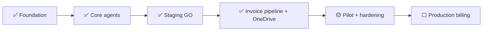

# Status & Milestone Report

| Field | Value |
|---|---|
| **Project** | FTF – Survey Invoicing & Billing Delivery (E2E) · **Client** NexGen Surveying / FTF |
| **Document** | Status & Milestone Report · **Version** 1.0 · **Reporting date** 2026-07-16 |
| **Prepared by** | Tisko Tech · **Owner** Prateek Chandra |

---

## Purpose
A one-page snapshot of where the project stands. Reusable as a weekly template.

## 1. Overall health

| KPI | Status |
|---|---|
| Scope | 🟢 On track |
| Schedule | 🟢 Core delivered; pilot ongoing |
| Quality | 🟢 Stable; issues fixed same-day |
| Risk | 🟡 Depends on FTF's invoice flagging |
| Production billing | 🟡 Gated on client GO |

## 2. Milestones

| Milestone | Target | Status |
|---|---|---|
| Foundation & connections | Sprint 0 | ✅ Done |
| Core agents (detect→deliver) | Sprints 1–9 | ✅ Done |
| Staging GO/NO-GO | Sprint 10 | ✅ GO |
| 8-agent invoice pipeline + Approvals sheet | Sprint 11 | ✅ Done |
| Pilot on staging + hardening | Now | 🟡 In progress |
| All loops live for real clients | Sprint 12 | ⬜ Pending GO |

## 3. Recent work (this period)
- Added 4 reference columns to the sheet (Property Size, Map Link, FEMA Zone, Service Type).
- Client Name now shows the **company** (ordering party), not the contact person.
- Fixed invoice line so the **service name you type is what appears** on the invoice.
- Strengthened learning from operator notes; applies to similar future orders.
- Intake raised to catch **all** new flagged orders; run cadence now **every 5 min**.
- Added a **twice-daily Teams report** (12 PM & 7 PM ET) with activity + who approved.
- Approvals now attributed to the **real person** (Sumit / Prateek), not a fixed name.

## 4. Numbers at a glance

| Metric | Value | Source |
|---|---|---|
| Build window | 2026-05-20 → 2026-07-14 | git |
| Commits | 6,621 | git |
| Version tags | 0 (releases tracked by feature commits) | git |
| Agents in pipeline | 8 (A0–A7) | codebase |
| Run cadence | Every 5 min (pipeline) + 5 min (approvals) | prod cron |

## 5. Risks & mitigations

| Risk | Impact | Mitigation |
|---|---|---|
| FTF doesn't flag an order for invoicing | Order won't appear | Staff handle manually; option to broaden intake |
| Workbook open while system writes | Dropdown/format lag | Self-heals next run; close/reopen to refresh |
| Simultaneous approvers | "Who approved" may attribute to most-recent editor | Optional "Approved By" column for exactness |

## 6. Next steps
- Continue pilot; collect operator feedback via the sheet.
- Confirm production-billing GO with the client (Sprint 12).

> `[CLIENT INPUT REQUIRED]` — confirm the pilot end date and the go-live decision owner.

---
**Revision history** — 1.0 (2026-07-16, Tisko Tech): initial template + current status.
