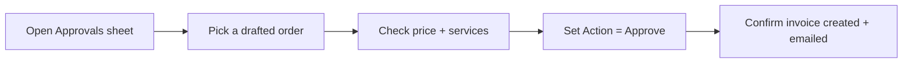

# UAT & Client Acceptance

| Field | Value |
|---|---|
| **Project** | FTF – Survey Invoicing & Billing Delivery (E2E) · **Client** NexGen Surveying / FTF |
| **Document** | UAT & Client Acceptance · **Version** 1.0 · **Status** Draft for review |
| **Prepared by** | Tisko Tech · **Owner** Prateek Chandra · **Updated** 2026-07-16 |

---

## Purpose
Show how we prove the system works, and give the client a simple sign-off.

## 1. How to test (5 steps)

## 2. Acceptance test cases

| # | Scenario | Steps | Expected result | Pass? |
|---|---|---|---|---|
| UAT-1 | New flagged order appears | Wait for a flagged order | Row appears with price + details | ☐ |
| UAT-2 | Reference data shows | Open the row | Size, Map Link, FEMA Zone, Service filled | ☐ |
| UAT-3 | Edit a price | Change `Service / Breakdown by User` | Total recalculates; name shows on invoice | ☐ |
| UAT-4 | Approve | Set Action = Approve | Invoice created in FTF + emailed | ☐ |
| UAT-5 | Reject | Set Action = Reject | No invoice, no email; AI learns | ☐ |
| UAT-6 | Hold | Set Action = On-hold | Paused; can approve later | ☐ |
| UAT-7 | Condo order | Wait for a condo | Auto-flagged, not billed | ☐ |
| UAT-8 | No duplicate | Approve an already-invoiced order | System skips; no second invoice | ☐ |
| UAT-9 | Who approved | Approve as a user | Report shows the real approver | ☐ |
| UAT-10 | Daily report | Wait for 12 PM / 7 PM ET | Teams report with activity + by whom | ☐ |

## 3. Entry & exit criteria

| Entry (before UAT) | Exit (UAT done) |
|---|---|
| Pipeline running on staging | All critical cases pass |
| Approvers have sheet access | No open blocker defects |
| Test orders available | Client signs acceptance below |

## 4. Defect handling
- Log any issue with a short note in the sheet or to Tisko Tech.
- Severity 1 (blocks billing) fixed same day; minor issues batched.

> `[CLIENT INPUT REQUIRED]` — assign the UAT tester(s) and the acceptance date.

---
## 5. Client acceptance sign-off

| Statement | Yes/No |
|---|---|
| The system meets the agreed requirements | ☐ |
| We accept it for the pilot / production stage indicated | ☐ |

| Name | Role | Signature | Date |
|---|---|---|---|
|  | Client sponsor |  |  |
|  | Operations lead |  |  |

**Revision history** — 1.0 (2026-07-16, Tisko Tech): initial.
