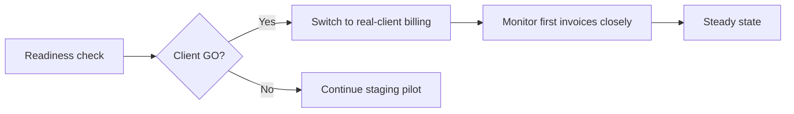

# Go-Live Checklist & Handover Guide

| Field | Value |
|---|---|
| **Project** | FTF – Survey Invoicing & Billing Delivery (E2E) · **Client** NexGen Surveying / FTF |
| **Document** | Go-Live Checklist & Handover · **Version** 1.0 · **Status** Draft for review |
| **Prepared by** | Tisko Tech · **Owner** Prateek Chandra · **Updated** 2026-07-16 |

---

## Purpose
The checklist to go live safely, and a clear handover of what you now own.

## 1. Go-live readiness checklist

| # | Item | Ready? |
|---|---|---|
| 1 | Pipeline runs on the production server every 5 min | ✅ |
| 2 | Approvals sheet live with Guide + How-To tabs | ✅ |
| 3 | Action dropdown (Approve/Reject/On-hold) working | ✅ |
| 4 | Duplicate-invoice guards active | ✅ |
| 5 | Twice-daily Teams report delivering | ✅ |
| 6 | Approver identity captured | ✅ |
| 7 | Approvers trained (see Training Guide) | ☐ |
| 8 | Client GO for real-client billing | ☐ |
| 9 | Support contact + hours agreed | ☐ |

## 2. Go-live flow

## 3. What you now own (handover)

| Item | You own | Notes |
|---|---|---|
| Approvals sheet | ✅ | Approve/edit in the blue columns |
| Pricing Rules tab | ✅ | Set fixed prices; no coding |
| Learning column | ✅ | Teach the AI in plain English |
| Daily Teams report | ✅ | Read-only monitoring |
| Server + pipeline | Tisko Tech (managed) | Support & maintenance |

## 4. Rollback / stop
- To pause billing: leave Action blank (nothing is sent).
- To stop the whole pipeline: Tisko Tech disables the timer (5-minute action).
- No invoice is ever sent without a human Approve, so there is no "runaway" risk.

## 5. Handover contents
- This documentation package.
- Access to the Approvals workbook (Excel/OneDrive).
- The Teams report channel.
- Support contact (below).

> `[CLIENT INPUT REQUIRED]` — confirm go-live date, first-week monitor owner, and
> the support contact + hours.

---
**Sign-off to go live**

| Name | Role | Decision | Date |
|---|---|---|---|
|  | Client sponsor | ☐ GO ☐ HOLD |  |

**Revision history** — 1.0 (2026-07-16, Tisko Tech): initial.
