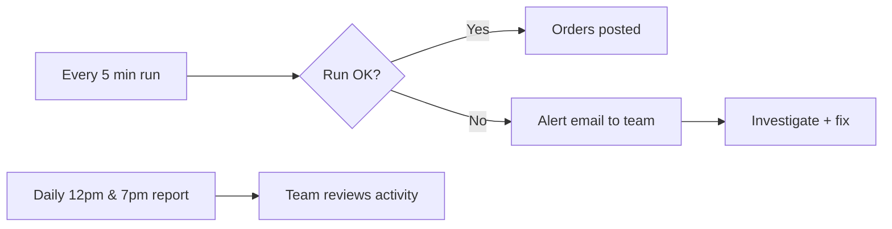

# Support & Maintenance Guide

| Field | Value |
|---|---|
| **Project** | FTF – Survey Invoicing & Billing Delivery (E2E) · **Client** NexGen Surveying / FTF |
| **Document** | Support & Maintenance Guide · **Version** 1.0 · **Status** Draft for review |
| **Prepared by** | Tisko Tech · **Owner** Prateek Chandra · **Updated** 2026-07-16 |

---

## Purpose
Explain how help works after go-live and what keeps the system healthy.

## 1. Who to contact

| Need | Contact |
|---|---|
| Something looks wrong on the sheet | Operations lead → Tisko Tech |
| Invoice not created / email not sent | Tisko Tech support |
| Pricing consistently wrong | Add a Pricing Rule, or tell Tisko Tech |
| Emergency (billing must stop) | Tisko Tech (pause the pipeline) |

> `[CLIENT INPUT REQUIRED]` — support email/phone, hours, and response times (SLA).

## 2. Support levels (suggested)

| Severity | Example | Target response |
|---|---|---|
| S1 Critical | Wrong invoices could be sent | Immediate; pause pipeline |
| S2 High | Orders not appearing at all | Same business day |
| S3 Medium | A price is off | 1–2 business days |
| S4 Low | Wording / cosmetic | Next release |

## 3. What maintenance covers
- Keeping the pipeline running 24/7 on the server.
- Fixing defects and adjusting rules.
- Small enhancements within scope.
- Watching the daily report and cost.

## 4. Routine health

- The pipeline **self-heals** each run (a bad run doesn't block the next).
- A failure alert email is sent to the team automatically.
- The daily report surfaces anything stuck.

## 5. Simple things the client can do (no coding)

| Task | How |
|---|---|
| Fix a price for a client/county | Add a row in the **Pricing Rules** tab |
| Teach the AI something | Type it in **Learning provided by user** |
| Pause an order | Leave Action blank or set On-hold |
| See what happened | Read the twice-daily Teams report |

## 6. Backups & continuity
- Order + invoice data live in FieldToFinish (client system of record).
- Pipeline state is stored and version-controlled.
- The server can be rebuilt from code if needed.

> `[CLIENT INPUT REQUIRED]` — confirm backup ownership and disaster-recovery expectations.

---
**Revision history** — 1.0 (2026-07-16, Tisko Tech): initial.
