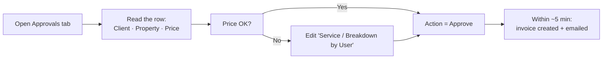

# Training Guide & FAQ

| Field | Value |
|---|---|
| **Project** | FTF – Survey Invoicing & Billing Delivery (E2E) · **Client** NexGen Surveying / FTF |
| **Document** | Training Guide & FAQ · **Version** 1.0 · **Status** Draft for review |
| **Prepared by** | Tisko Tech · **Owner** Prateek Chandra · **Updated** 2026-07-16 |

---

## Purpose
Teach an approver to use the system in a few minutes. No technical knowledge needed.

## 1. The only place you work
The **Approvals** tab in the OneDrive workbook. Blue columns are yours to edit;
gray columns are managed by the AI.

## 2. Your daily routine (5 steps)

## 3. The service-entry standard
Type each service as **`Service Name: $Amount`**, separated by a pipe `|`.

| Example | Meaning |
|---|---|
| `Boundary Survey: $500.00` | One service, $500 |
| `Boundary Survey: $500.00 \| Elevation Certificate: $150.00` | Two services, $650 total |

- The **name you type is the name that prints on the invoice.**
- Change the number to reprice; the total updates automatically.
- Then set **Action = Approve**.

## 4. The three actions

| Action | What happens |
|---|---|
| **Approve** | Real invoice is created in FTF and emailed to the client |
| **Reject** | Nothing is sent; the AI learns from it |
| **On-hold** | Paused; approve or reject later |
| *(blank)* | Ignored until you choose |

## 5. Teach the AI (no coding)
- **One order:** type a note in **Learning provided by user** (e.g. "this client is always $1,800 for a boundary"). The AI reads it next run and applies it to similar orders.
- **A permanent price:** add a row in the **Pricing Rules** tab.

## 6. FAQ

| Question | Answer |
|---|---|
| **Some order numbers are missing on the sheet — why?** | The AI only brings orders FTF flags as *needing an invoice*. Quotes / in-progress orders aren't flagged, so they don't appear. This is normal. |
| **An order I expected isn't here.** | It likely isn't flagged `invoice_needed` in FTF yet. When FTF flags it, it appears on the next run. |
| **Will it ever send without me?** | No. Nothing is created or emailed without your **Approve**. |
| **Can it send twice?** | No. Duplicate guards stop a second invoice. |
| **I don't see the Approve dropdown.** | Close and reopen the workbook — your view was cached. |
| **The dollar total didn't update.** | Keep the `Name: $Amount` format and the `$`; it recalculates each run. |
| **Who approved an order?** | The twice-daily Teams report shows the approver by name. |
| **A condo order appeared.** | It's auto-flagged as "cannot survey" and not billed — contact the client. |

## 7. Getting help
Ask your operations lead, or contact Tisko Tech support (see Support & Maintenance Guide).

> `[CLIENT INPUT REQUIRED]` — confirm who runs the 30-minute live training session and when.

---
**Revision history** — 1.0 (2026-07-16, Tisko Tech): initial.
