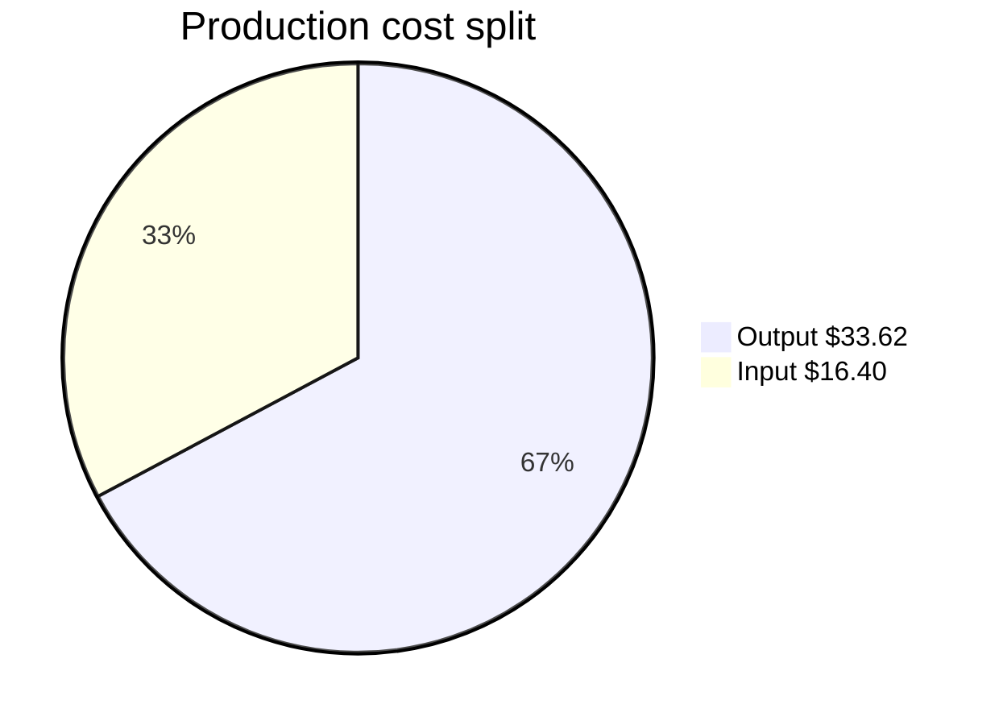
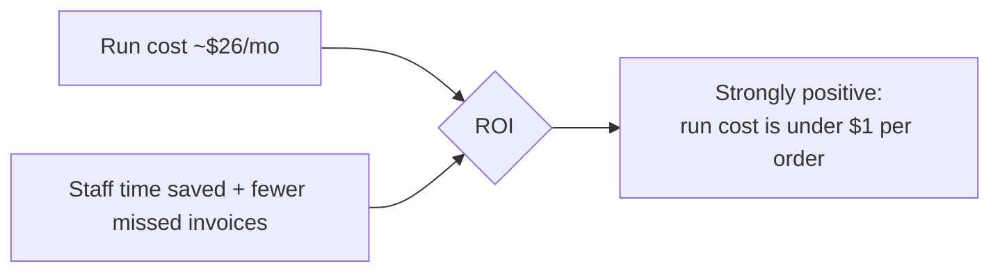

# AI Cost, Pricing & ROI

| Field | Value |
|---|---|
| **Project** | FTF – Survey Invoicing & Billing Delivery (E2E) · **Client** NexGen Surveying / FTF |
| **Document** | AI Cost, Pricing & ROI · **Version** 1.0 · **Status** Draft for review |
| **Prepared by** | Tisko Tech · **Owner** Prateek Chandra · **Updated** 2026-07-16 |
| **Measurement window** | 2026-05-20 → 2026-07-17 (~1.9 months) |

---

## Purpose
Show what the AI costs — using **measured** numbers, not estimates. Two costs are
reported: what it costs to **run** (production) and the value of what it took to
**build** (development).

## 1. The answer first

| Cost | Amount | What it means |
|---|---|---|
| **Production (run cost)** | **≈ $50** total (~**$26 / month**) | The live AI spend to date |
| **Development (build value)** | **≈ $386** (measured local sessions) | List-rate value of build tokens on record |
| **Cost per order (run)** | **< $1** (~$0.72) | AI cost to prepare one order |

> The run cost is **tiny** relative to the value of each survey invoice. One approved
> invoice typically covers **months** of AI run cost.

## 2. Production (run) cost — MEASURED, authoritative

Source: Anthropic **Admin Usage API**, filtered to this project's live key
**`FTF-Invoicing Agent`**, priced at official list rates. Single model in production:
**Claude Sonnet 4.6**. No cached tokens used.

| Item | Tokens | Rate /MTok | Cost |
|---|---|---|---|
| Input | 5,467,559 | $3 | $16.40 |
| Output | 2,241,239 | $15 | $33.62 |
| **Total** |  |  | **$50.02** |

- **Monthly run rate:** ≈ **$26 / month**.
- **Per order:** ≈ **$0.72** (≈ $50 ÷ ~69 orders currently tracked; illustrative).
- Confidence: **High** — isolated to the one production key and priced at list rates.

## 3. Development (build) cost — MEASURED (local sessions)

Source: this project's **Claude Code transcripts** on record, **deduped by message id**,
model **Claude Opus 4.8**, priced at list rates.

| Item | Tokens | Rate /MTok | Cost |
|---|---|---|---|
| Input | 13,300 | $15 | $0.20 |
| Output | 629,125 | $75 | $47.18 |
| Cache write | 8,680,345 | $18.75 | $162.76 |
| Cache read | 117,063,738 | $1.50 | $175.60 |
| **Total** |  |  | **$385.74** |

> ⚠️ **Scope note (honest):** only the **locally-retained** transcript is available
> (one session file). This figure is exact **for the sessions on record**, but it does
> **not** capture the full multi-month build across all machines/sessions — so true
> total build cost is **higher**. Development cost is a list-rate **value**, not an invoice.

## 4. ROI

| Item | Before (manual) | After (AI + approve) |
|---|---|---|
| Prepare an invoice | several minutes each | seconds to draft + a quick check |
| Orders missed for billing | occasional | ~0 flagged orders missed |
| Pricing consistency | varies by person | rule-based + learning |
| Monthly AI run cost | — | ≈ $26 |

> `[CLIENT INPUT REQUIRED]` — provide current **staff minutes per invoice** and **invoices/month**
> to convert time saved into a dollar ROI and a payback period.

## 5. How these numbers were produced (provenance)
- **Production:** `GET /v1/organizations/usage_report/messages` filtered by
  `api_key_ids=[FTF-Invoicing Agent]`, summed tokens, priced at list rates.
- **Development:** local `~/.claude/projects/<this-project>/*.jsonl`, deduped by
  `message.id`, priced at list rates.
- Rates: Sonnet 4.6 $3/$15 per MTok; Opus 4.8 $15/$75, cache-write $18.75, cache-read $1.50.
- No figure is estimated; scope is strictly this project's key/transcripts.

---
**Revision history**

| Version | Date | Author | Change |
|---|---|---|---|
| 0.9 | 2026-07-16 | Tisko Tech | Structure + method (cost pending) |
| 1.0 | 2026-07-16 | Tisko Tech | Filled with measured production + dev cost |
