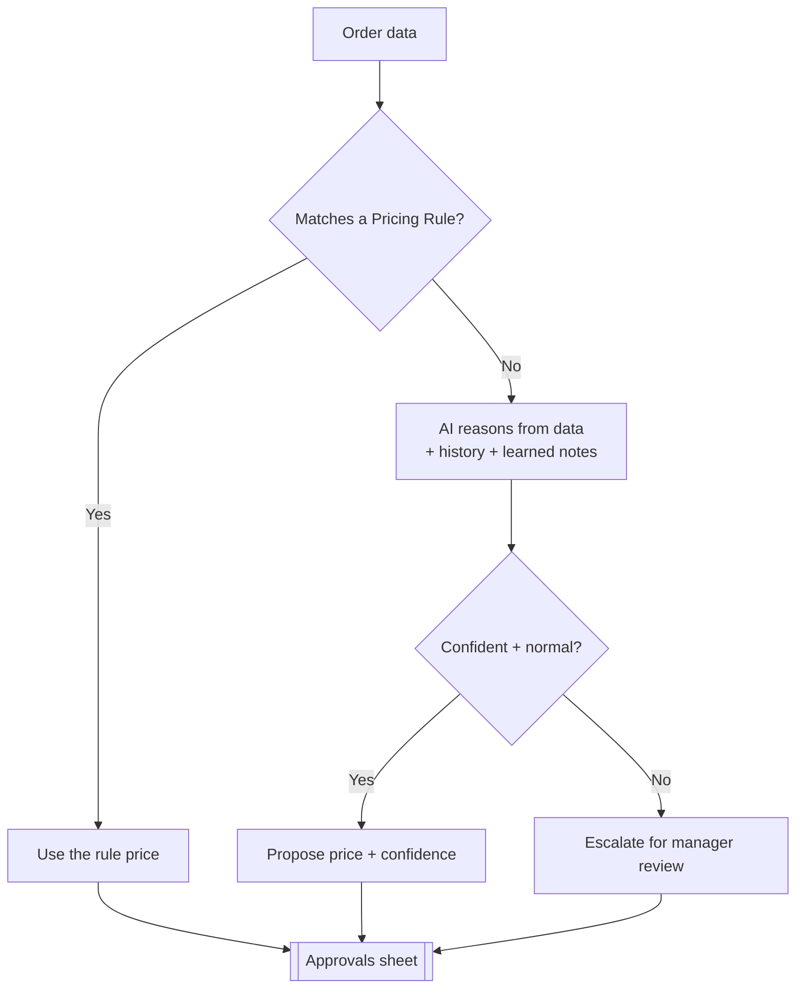
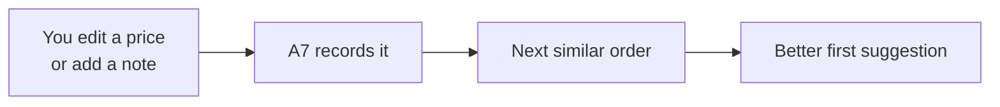

# AI Solution Guide

| Field | Value |
|---|---|
| **Project** | FTF – Survey Invoicing & Billing Delivery (E2E) · **Client** NexGen Surveying / FTF |
| **Document** | AI Solution Guide · **Version** 1.0 · **Status** Draft for review |
| **Prepared by** | Tisko Tech · **Owner** Prateek Chandra · **Updated** 2026-07-16 |

---

## Purpose
Explain, for a non-technical reader, what the AI does, what it does **not** do,
and the safeguards that keep it trustworthy.

## 1. What the AI is for
To **prepare** survey invoices — read the order, decide a fair price, and draft the
bill — so a person only has to **check and approve** instead of building each one.

## 2. What the AI can do

| Capability | Plain meaning |
|---|---|
| Read order data | Pulls address, lot size, county, flood zone, service type |
| Look at the property | Uses parcel/aerial + county data as pricing context |
| Suggest a price | Uses your rules + market history + reasoning |
| Explain itself | Gives a short reason and a confidence level |
| Detect special cases | Condo, canceled, delivered, duplicate orders |
| Learn | Adjusts from your edits and notes |

## 3. What the AI will NOT do

| Limit | Why it matters |
|---|---|
| Never sends without approval | You are always in control |
| Never invents an order or client | Only works from real FTF data |
| Won't price truly unusual jobs | It **escalates** to a manager instead |
| Won't re-bill an invoiced order | Duplicate guards |
| Won't survey condos | Auto-flags them as out of scope |

## 4. How it decides a price

## 5. Confidence & human review

| Confidence | Meaning | Suggested action |
|---|---|---|
| 🟢 High | Strong data + clear rule/history | Quick check, approve |
| 🟡 Medium | Reasonable but verify | Review price |
| 🔴 Low / Escalate | Unusual or thin data | Manager reviews |

**Human review points:** every order (approval gate), plus any Escalate flag.

## 6. Safety & guardrails
- **Approval gate:** nothing created/sent without a human Approve.
- **Duplicate prevention:** re-checks FTF before creating.
- **Canceled/condo/delivered guards:** flagged, never billed.
- **Learning is additive:** operator notes guide the AI; they don't bypass approval.
- **Full audit:** every step logged; the approver's name recorded.

## 7. Learning loop

## 8. Privacy & data
- Works only with data already in **FieldToFinish** and **Microsoft 365**.
- No client data is stored outside those systems and the project's own state.
- AI provider: **Anthropic Claude**; prompts contain order details needed to price.

> `[CLIENT INPUT REQUIRED]` — confirm any data-handling / compliance clauses required
> in your client contracts (e.g. PII handling, retention).

## 9. Expected accuracy
- On standard orders with a rule or clear history: high.
- Accuracy improves as the AI learns from approvals/edits.
- Unusual jobs are escalated rather than guessed — by design.

---
**Revision history** — 1.0 (2026-07-16, Tisko Tech): initial.
