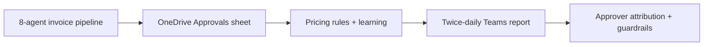
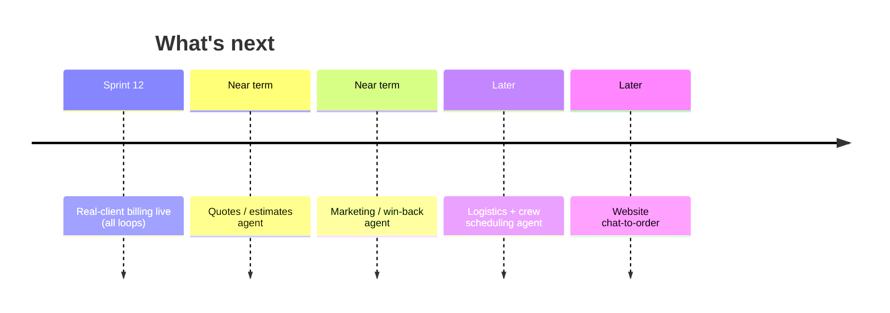

# Project Closeout & Future Roadmap

| Field | Value |
|---|---|
| **Project** | FTF – Survey Invoicing & Billing Delivery (E2E) · **Client** NexGen Surveying / FTF |
| **Document** | Closeout & Future Roadmap · **Version** 1.0 · **Status** Draft for review |
| **Prepared by** | Tisko Tech · **Owner** Prateek Chandra · **Updated** 2026-07-16 |

---

## Purpose
Summarize what was delivered in this phase and lay out what comes next.

## 1. What was delivered

| Delivered | State |
|---|---|
| A0–A7 invoice pipeline (find → draft → approve → create → email → learn) | ✅ |
| OneDrive Approvals sheet + Guide/How-To tabs | ✅ |
| Reference columns (size, map link, FEMA zone, service type) | ✅ |
| Consistent pricing (rules) + learning from edits | ✅ |
| Twice-daily Teams monitoring report | ✅ |
| Human-approval safety + duplicate/condo/cancel guards | ✅ |
| Real approver captured per decision | ✅ |

## 2. Lessons learned (kept short)

| What we learned | Action taken |
|---|---|
| Excel Online caches an open file | Self-heal on next run; guide users to reopen |
| Approver identity isn't per-cell in Graph | Attribute via activity feed; optional exact column |
| The AI is only as complete as FTF's flag | Documented; option to broaden intake |

## 3. Future roadmap

| Item | Value | Priority |
|---|---|---|
| Production billing for real clients | Full automation benefit | ⭐ Next |
| Quotes / estimates automation | Faster front-of-funnel | High |
| Marketing / win-back agent | Recover inactive clients | Medium |
| Logistics / crew scheduling | Operational efficiency | Later |
| Website chat-to-order | New order capture | Later |

*(Roadmap items are drawn from the project backlog; scope/pricing per future SOWs.)*

## 4. Closeout checklist

| Item | Done? |
|---|---|
| Deliverables accepted (UAT signed) | ☐ |
| Documentation handed over | ☐ |
| Support model agreed | ☐ |
| Future phases scoped | ☐ |

> `[CLIENT INPUT REQUIRED]` — confirm phase closeout date and sign-off owner.

---
**Sign-off**

| Name | Role | Decision | Date |
|---|---|---|---|
|  | Client sponsor | ☐ Accept |  |

**Revision history** — 1.0 (2026-07-16, Tisko Tech): initial.
