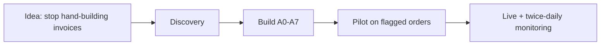

# Project Charter, RAID Log & Decision Register

| Field | Value |
|---|---|
| **Project** | FTF – Survey Invoicing & Billing Delivery (E2E) · **Client** NexGen Surveying / FieldToFinish |
| **Document** | Project Charter, RAID Log & Decision Register · **Version** 1.0 · **Status** Internal |
| **Prepared by** | Tisko Tech · **Owner** Prateek Chandra · **Updated** 2026-07-16 |
| **Audience** | Delivery team, PMO, engineering leads |

> **Internal document.** Contains delivery detail not shared with the client. No secrets/keys.

## Table of Contents
1. Purpose & Scope
2. Project Charter
3. Governance & Team
4. RAID Log (Risks / Assumptions / Issues / Dependencies)
5. Decision Register
6. Change Request Register
7. Approval & Revision History

---

## 1. Purpose & Scope
Give the delivery team one control document: why the project exists, who owns what,
what could go wrong (RAID), what we decided, and what changed.

**In scope:** the automated pipeline that finds FTF orders needing an invoice, drafts a
priced invoice, routes it to a human for approval, creates the real invoice in FTF,
emails the client, and learns from edits. **Out of scope:** quotes, marketing, crew
scheduling (future phases).

## 2. Project Charter

| Item | Detail |
|---|---|
| **Problem** | Invoices were built by hand — slow, inconsistent pricing, orders occasionally missed for billing. |
| **Goal** | AI drafts every flagged invoice; a human only checks & approves. |
| **Success measures** | ~0 flagged orders missed · consistent rule-based pricing · seconds to draft · run cost < $1/order. |
| **Solution type** | AI Agent pipeline (8 agents A0–A7) + OneDrive approval sheet + Teams reporting. |
| **Sponsor** | `[CLIENT INPUT REQUIRED]` — NexGen sponsor name. |
| **Delivery owner** | Tisko Tech (Prateek Chandra). |

## 3. Governance & Team

| Role | Owner | Responsibility |
|---|---|---|
| Delivery / Tech lead | Prateek Chandra | Architecture, deploy, sign-off |
| Client operations | Sumit Parik + NexGen staff | Approve/reject on the sheet |
| Domain (surveying) | FL PLS advisor | Pricing rules, service types |
| AI provider | Anthropic (Claude) | Model runtime |

**Cadence:** async status via twice-daily Teams report; escalations ad-hoc.

## 4. RAID Log

### Risks
| ID | Risk | Impact | Likelihood | Mitigation |
|---|---|---|---|---|
| R1 | AI mis-prices an unusual job | Wrong bill | Med | Human approval gate + escalate on low confidence |
| R2 | Excel Online caches an open file → edits not seen | Stale run | Med | Self-heal next run; guide users to reopen |
| R3 | FTF never flags an order `invoice_needed` | Order not surfaced | Low | Documented; option to broaden intake |
| R4 | Duplicate invoice created | Double bill | Low | Pre-create re-check against FTF |
| R5 | Anthropic/Graph/SMTP outage | Pipeline stalls | Low | Read-only report independent; flock guards; retries |

### Assumptions
- FTF `ng_invoice_needed=1` is the authoritative "bill this" signal.
- Every invoice passes a human approval before creation/sending.
- One production Anthropic key isolates this project's cost.

### Issues (resolved)
| ID | Issue | Resolution |
|---|---|---|
| I1 | Edited service name blank on invoice | FTF renders `description`; A5 now falls back name→desc→"Survey Service" |
| I2 | Action dropdown missing 3 values | Rebuilt validation on col O (O2:O10000) via openpyxl |
| I3 | Extra "AI Agent Created Invoice" log line | Confirmed server-side (FTF), not ours — left to system |

### Dependencies
| Dependency | Type | Notes |
|---|---|---|
| FTF stage API + MySQL | External | Order data + invoice creation |
| Microsoft Graph (Workbook + activities) | External | Sheet read/write, real editor identity |
| Anthropic Claude | External | Sonnet 4.6 (run), Opus 4.8 (build) |
| Power Automate flow (`TEAMS_FLOW_URL`) | External | Teams delivery |
| EC2 host + cron | Internal infra | Scheduling |

## 5. Decision Register (delivery decisions)

| # | Decision | Rationale | Date |
|---|---|---|---|
| D1 | Human approval gate is mandatory; AI never auto-approves/sends | Safety & trust | Sprint 11 |
| D2 | Cron cadence 5 min (30 → 15 → 5) | Faster capture of new flagged orders | 2026-07 |
| D3 | Two Teams monitoring reports/day (12 PM & 7 PM ET) | Operational visibility + by-whom audit | 2026-07 |
| D4 | Attribute approvals to real editor via Graph activities feed | Accurate "by whom" without new log infra | 2026-07 |
| D5 | Do NOT write our own FTF order-log lines | "Let the system do it by itself" | 2026-07 |
| D6 | Service-entry standard `Name: $Amount \| …` | Edits flow to invoice deterministically | 2026-07 |

## 6. Change Request Register

| CR | Request | Status | Result |
|---|---|---|---|
| CR1 | Show edited service name on invoice | ✅ Done | A5 label fallback |
| CR2 | Learn from "Learning provided by user" each run + apply to similar orders | ✅ Done | A3 rule injection strengthened |
| CR3 | Bring 10 named test orders to sheet | ✅ Done | 10/10 seeded |
| CR4 | Cron → 5 min | ✅ Done | caps 100/30/30 |
| CR5 | Twice-daily Teams report + tabs updated | ✅ Done | deployed + verified |
| CR6 | Approver attribution (Sumit vs Prateek) | ✅ Done | activities feed |
| CR7 | Col-F map link opens the parcel, not search | ✅ Done | Regrid locality URL (new orders) |
| CR8 | Server backup of the full sheet + shareable URL | ✅ Done | local + OneDrive copy, org link, every cycle |

---
**Approval**

| Name | Role | Decision | Date |
|---|---|---|---|
|  | Delivery lead | ☐ Approve |  |

**Revision history** — 1.0 (2026-07-16, Tisko Tech): initial internal charter/RAID/decisions.
