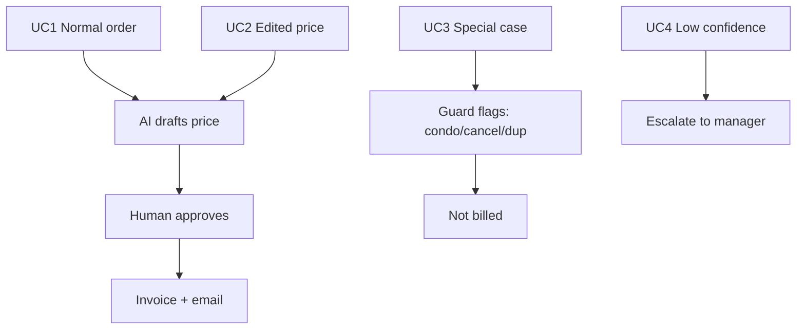
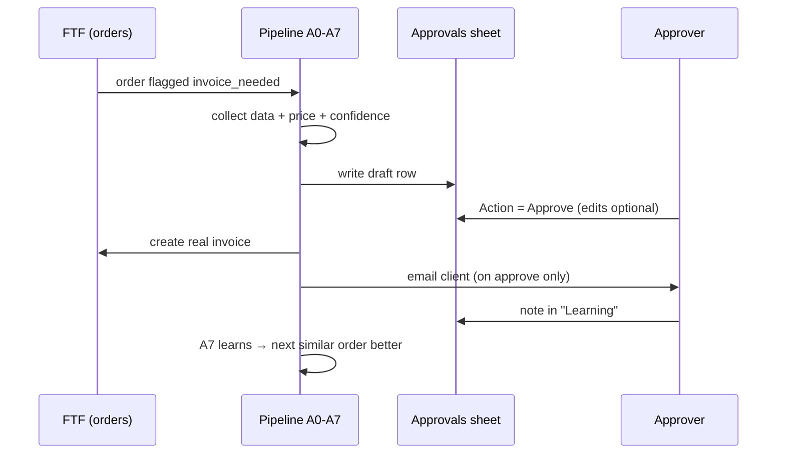

# Internal Requirements, Business Rules & User Stories

| Field | Value |
|---|---|
| **Project** | FTF – Survey Invoicing & Billing Delivery (E2E) · **Client** NexGen Surveying / FTF |
| **Document** | Internal Requirements, Business Rules & User Stories · **Version** 1.0 · **Status** Internal |
| **Prepared by** | Tisko Tech · **Owner** Prateek Chandra · **Updated** 2026-07-16 |
| **Audience** | BA, developers, QA |

## Table of Contents
1. Purpose & Scope
2. Functional requirements
3. Business rules (pricing & guards)
4. User stories + acceptance criteria
5. Core use cases
6. Workflow (end-to-end)
7. Approval & Revision History

---

## 1. Purpose & Scope
The single source for **what the system must do** and **the rules it must obey**.
Scope = invoice preparation for FTF orders flagged `invoice_needed`, through human
approval, creation, send, and learning.

## 2. Functional requirements

| ID | Requirement | Priority |
|---|---|---|
| FR1 | Detect FTF orders with `ng_invoice_needed=1` not yet invoiced | Must |
| FR2 | Collect order data (address, lot size, county, flood zone, service type) | Must |
| FR3 | Propose a price from Pricing Rules → history → AI reasoning, with confidence | Must |
| FR4 | Write a draft row to the OneDrive **Approvals** tab | Must |
| FR5 | Read the human **Action** (Approve / On-hold / Reject) each run | Must |
| FR6 | On Approve, create the real invoice in FTF and email the client | Must |
| FR7 | Never create/send without a human Approve | Must |
| FR8 | Read **Learning provided by user** each run; apply to this + similar orders | Must |
| FR9 | Honor the service-entry standard `Name: $Amount \| …` so edits reach the invoice | Must |
| FR10 | Guard against duplicate / condo / canceled / delivered orders | Must |
| FR11 | Record the **real approver** per decision | Must |
| FR12 | Post a monitoring report twice daily (12 PM & 7 PM ET) | Must |
| FR13 | Escalate low-confidence / unusual jobs instead of guessing | Must |

## 3. Business rules

### Pricing
- **BR-P1:** A matching Pricing Rule wins over AI reasoning.
- **BR-P2:** No rule → AI reasons from order data + market history + learned notes.
- **BR-P3:** Line total = sum of `Name: $Amount` entries in the **"Service / Breakdown by User"** column (col K); the total (col L) recalculates each run.
- **BR-P4:** Low confidence or unusual job → **Escalate** (manager review), never auto-priced.

### Guards (never bill)
| Rule | Condition | Action |
|---|---|---|
| BR-G1 Duplicate | Order already invoiced in FTF | Skip; do not re-bill |
| BR-G2 Condo | Order is a condo (out of scope) | Flag "cannot survey"; not billed |
| BR-G3 Canceled | Order canceled | Flag; not billed |
| BR-G4 Delivered | Already delivered/closed | Flag; not billed |

### Learning
- **BR-L1:** A note in "Learning provided by user" is read **every run**.
- **BR-L2:** A note applies to that order **and** similar orders (same client, same/related
  service, or neighbouring county).
- **BR-L3:** Learning is **additive** — it guides pricing; it never bypasses the approval gate.

### Safety
- **BR-S1:** Only a human sets Action; the AI/agent never approves.
- **BR-S2:** No client email is sent except as a result of a human Approve.
- **BR-S3:** The system owns FTF order-log lines; the agent does not write them.

## 4. User stories + acceptance criteria

| # | As a… | I want… | So that… | Acceptance |
|---|---|---|---|---|
| US1 | Ops approver | to see a drafted price per order | I only check, not build | Draft row with price + confidence appears within ~5 min |
| US2 | Ops approver | to edit the service line | the invoice reflects my change | Edited `Name: $Amount` prints on the invoice; total updates |
| US3 | Ops approver | to teach the AI in plain words | future bills are better | Note read next run; similar orders repriced |
| US4 | Manager | nothing sent without approval | we stay in control | No invoice/email created for blank/On-hold/Reject |
| US5 | Delivery lead | to see who approved what | we have an audit | Twice-daily report lists approver by name |

## 5. Core use cases

## 6. Workflow (end-to-end)

---
**Approval**

| Name | Role | Decision | Date |
|---|---|---|---|
|  | BA / Product | ☐ Approve |  |

**Revision history** — 1.0 (2026-07-16, Tisko Tech): initial.
