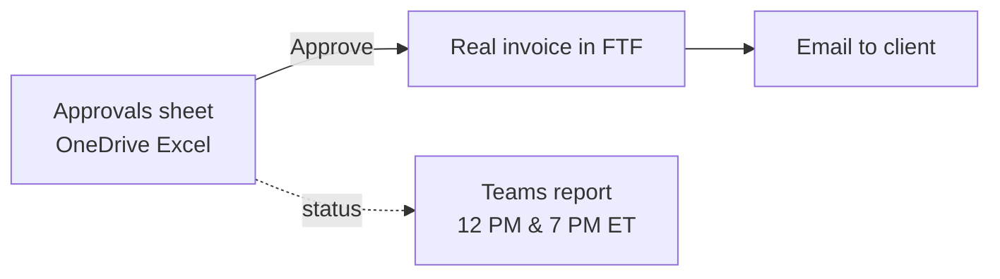
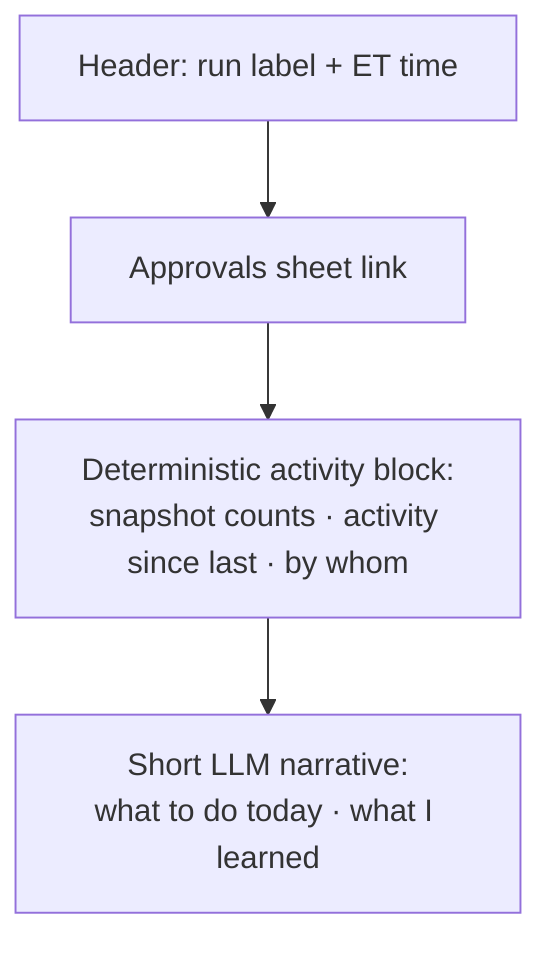
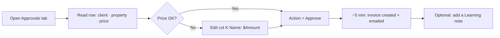

# UX, Interface Design & User Flows

| Field | Value |
|---|---|
| **Project** | FTF – Survey Invoicing & Billing Delivery (E2E) · **Client** NexGen Surveying / FTF |
| **Document** | UX, Interface Design & User Flows · **Version** 1.0 · **Status** Internal |
| **Prepared by** | Tisko Tech · **Owner** Prateek Chandra · **Updated** 2026-07-16 |
| **Audience** | UI/UX, developers, ops |

## Table of Contents
1. Purpose & Scope
2. Interfaces at a glance
3. The Approvals sheet (the primary UI)
4. Teams monitoring report
5. Client invoice email
6. User flow (approver)
7. Design guidelines
8. Approval & Revision History

---

## 1. Purpose & Scope
The system has **no custom app UI**. The user works in tools they already know:
an **Excel sheet** (approvals), a **Teams chat** (monitoring), and the **client email**
(output). This doc defines each surface and the approver's flow.

## 2. Interfaces at a glance

| Surface | Tool | Who | Purpose |
|---|---|---|---|
| Approvals tab | Excel Online | Approver | Review price, edit, set Action |
| Guide / How-To / Pricing Rules tabs | Excel Online | Approver | Help + rules |
| Teams report | Teams chat "AI - Invoicing Agent" | Team | Monitor activity + by-whom |
| Invoice email | Email | Client | Receives the bill |

## 3. The Approvals sheet (primary UI)

Blue columns = human-editable; gray = AI-managed.

| Col | Field | Owner |
|---|---|---|
| A–F | Order id, client, property, service type, size, map link | AI |
| G | FEMA Zone (reference) | AI |
| I / J | Service / Breakdown **by AI** + Amount by AI (locked baseline) | AI |
| **K** | **Service / Breakdown by User** (`Name: $Amount \| …`) — invoiced source of truth | **Human** |
| L | Amount ($) by User (auto-calculated from col K) | AI |
| **O** | **Action** (Approve / On-hold / Reject) — dropdown | **Human** |
| **T** | **Learning provided by user** — free-text teaching note | **Human** |
| approved_by, invoice_id, timestamps | audit | AI |

> Blue (editable) columns are **K (Service / Breakdown by User)**, **O (Action)**, Notes,
> and **T (Learning)**. Everything else is gray/AI-managed. **Col G is FEMA Zone, not the
> price cell** — edit the breakdown in **col K**.

**Key interactions**
- **Action dropdown** (col O, validation O2:O10000) — 3 values Approve / On-hold / Reject.
- **Service-entry standard** — `Boundary Survey: $500.00 | Elevation Certificate: $150.00`.
  The typed **name is what prints** on the invoice; changing the number reprices.
- **Learning cell** — plain-English note; read every run.

> UX rule: if the dropdown/total looks wrong, the fix is **close + reopen** the workbook
> (Excel Online cached the open file).

## 4. Teams monitoring report (12 PM & 7 PM ET)

- **Deterministic block is authoritative** — exact counts/by-whom are computed, not written by the model.
- "By whom" = real editor from the Graph activities feed for human decisions; agents A1–A7 for automated steps.

## 5. Client invoice email
- Sent **only** after a human Approve.
- Line label = the service **name** the approver typed (never blank).
- Standard FTF invoice template; amount = sum of the col-K "Service / Breakdown by User" lines.

## 6. User flow (approver)

## 7. Design guidelines
- **Reuse familiar tools** — no training on a new app.
- **Blue = yours, gray = ours** color contract on the sheet.
- **One action per row** — the Action dropdown is the only commit control.
- **Plain language** in Guide/How-To tabs (Grade-5).
- **No destructive controls** exposed to the user; the AI never has an "approve" control.

---
**Approval**

| Name | Role | Decision | Date |
|---|---|---|---|
|  | UI/UX lead | ☐ Approve |  |

**Revision history** — 1.0 (2026-07-16, Tisko Tech): initial.
