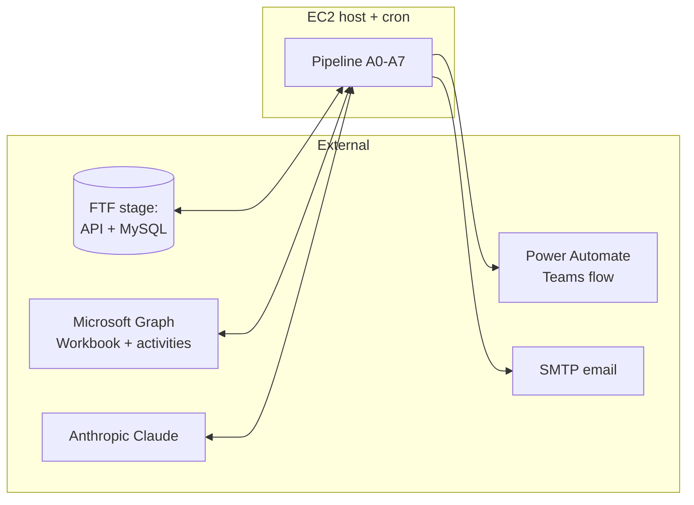
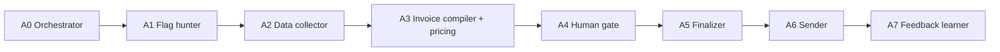
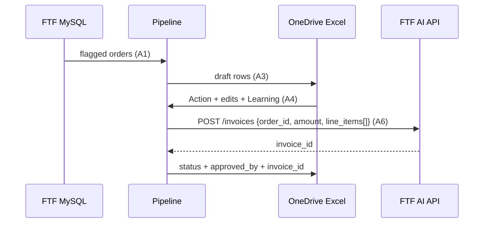
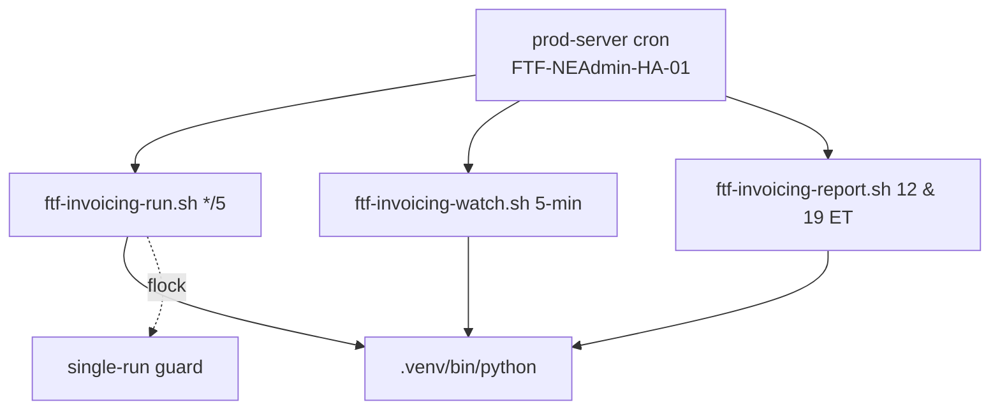

# Solution & Technical Architecture

| Field | Value |
|---|---|
| **Project** | FTF – Survey Invoicing & Billing Delivery (E2E) · **Client** NexGen Surveying / FTF |
| **Document** | Solution & Technical Architecture · **Version** 1.0 · **Status** Internal |
| **Prepared by** | Tisko Tech · **Owner** Prateek Chandra · **Updated** 2026-07-16 |
| **Audience** | Architects, developers, DevOps, security |

> **Internal.** Implementation detail included. No API keys, passwords, or connection secrets.

## Table of Contents
1. Purpose & Scope
2. System context
3. Component architecture (A0–A7)
4. Data flow
5. Data model (FTF + state store)
6. Integrations & APIs
7. Infrastructure & deployment
8. Security architecture
9. Environment configuration
10. Approval & Revision History

---

## 1. Purpose & Scope
The end-to-end technical picture: components, data, integrations, hosting, and security
for the invoicing pipeline.

## 2. System context

## 3. Component architecture (A0–A7)

| Agent | Responsibility | Key detail |
|---|---|---|
| A0 | Orchestrate the run, caps | run caps 100/30/30 |
| A1 | Find `ng_invoice_needed=1`, not invoiced | intake watermark on `ng_id` |
| A2 | Collect order data | address, lot, county, flood zone, service |
| A3 | Compile + price | rules → history → AI; injects learned rules for similar orders |
| A4 | Human gate | reads Action + `INPUT_APPROVER`; sets `approved_by` |
| A5 | Finalize | builds FTF line items; label = name→desc→"Survey Service" |
| A6 | Send | creates FTF invoice, emails client (on approve only) |
| A7 | Learn | records edits/notes for next similar order |

## 4. Data flow

## 5. Data model

**FTF (stage MySQL, pymysql DictCursor):**
- `ng_order` — orders; `ng_invoice_needed`, `ng_status`, `ng_id` (watermark), client fields.
- `ng_invoice` / invoice records created via API.

**State store (OneDrive Excel + local `pipeline_state`):**
- **Approvals** tab — `APPROVAL_HEADERS` (20 cols); `_COL_*` derived via `.index()`;
  `_COL_ACTION`=14 (col O).
- `pipeline_state` — per-order: `order_id, status, client_name, service_type,
  estimate_amount, invoice_id, approved_by, data_collected_at, draft_posted_at,
  invoice_created_at, sent_at, updated_at` (`get_all_orders()` / `get_orders_by_status()`).

**Status funnel:** `invoice_needed → data_collected → pricing_needed →
invoice_draft_posted → (on_hold) → invoice_approved → invoice_finalized →
invoice_sending → invoice_sent`; plus `invoice_rejected, condo_rejected,
delivered_flagged, canceled_flagged, details_missing`.

## 6. Integrations & APIs

| Integration | Endpoint / mechanism | Notes |
|---|---|---|
| FTF AI API | `POST /invoices` `{order_id, amount, line_items:[{name,description,amount}]}` | Renders `description` as the line label; **server auto-logs** the "AI Agent Created Invoice — N Line Items" line |
| FTF MySQL | `core.ftf_mysql._connect()` (pymysql DictCursor) | Read orders (`ng_order`, `ng_invoice_needed`, `ng_id` watermark). *(The seed helper `seed_specific_orders.py` normalizes a 6-digit id to `"1000"+id`; live intake uses the id verbatim.)* |
| Graph Workbook | read/write Approvals tab | Data **validation NOT supported** by Graph (v1.0 & beta 400) → use openpyxl |
| Graph activities | `/drives/{drive}/items/{item}/activities` | Real human editors → `get_recent_editors()`, `get_current_approver()` |
| Teams | Power Automate HTTP flow (`TEAMS_FLOW_URL`) | Report delivery; not Graph, not webhook |
| Anthropic | Claude Sonnet 4.6 (run) | Pricing/reasoning |

## 7. Infrastructure & deployment

**Single-runner model (since 2026-06-26).** The pipeline runs on the **prod server** — the
only host that reaches the private FTF RDS for A1 intake. The equivalent GitHub Actions
workflows (`invoice_pipeline.yml`, `excel_approval_watcher.yml`, `approval_poller.yml`) were
**disabled at cutover** so there is exactly one runner and one state file (no duplicate
invoices/emails). The crontab calls `/home/ubuntu/ftf-invoicing-*.sh`, which are
symlinks/wrappers to the `scripts/run_server_*.sh` files.

| Item | Value |
|---|---|
| Host | Prod server `FTF-NEAdmin-HA-01` (private infra) |
| Deploy dir | `/home/ubuntu/FTF Invoicing Agent` |
| Runtime | `.venv/bin/python` (server venv, Python 3.10) |
| Cron (live) | `ftf-invoicing-run.sh` `*/5`; `ftf-invoicing-watch.sh` every 5 min; `ftf-invoicing-report.sh` `0 16,17,23,0` UTC (ET-hour guard {12,19}) |
| Wrappers → | `scripts/run_server_pipeline.sh`, `run_server_watcher.sh`, `run_server_daily_report.sh` |
| Run caps (live `.env`) | A1 `MAX_NEW_PER_RUN=100` · A2 `MAX_PER_RUN=30` · A3 `INVOICE_BATCH_SIZE=30` (the "100/30/30" per tick) |
| Concurrency | `flock` guards prevent overlap |

## 8. Security architecture
- **Secrets** live only in `.env` on the host — never in code, logs, or docs.
- **Least privilege:** the pipeline uses scoped app credentials for Graph + FTF.
- **Human gate** is the primary control: no external side effect (invoice/email) without a human Approve.
- **Approver identity** recorded per decision from the Graph activities feed.
- **Auditability:** every status transition + approver captured in the state store.
- **No PII in the repo:** documents carry no client PII or secrets.

## 9. Environment configuration
Config via `.env` (keys referenced by name only): FTF API base + DB creds, Graph app
creds + drive/item ids, Anthropic key, `TEAMS_FLOW_URL`, SMTP creds, run caps.
`INPUT_APPROVER` is set per cycle from `get_current_approver()`.

> **py3.10 pitfall:** f-strings containing backslashes fail — build strings with plain
> variables (recurring issue in SSH heredocs).

---
**Approval**

| Name | Role | Decision | Date |
|---|---|---|---|
|  | Enterprise architect | ☐ Approve |  |

**Revision history** — 1.0 (2026-07-16, Tisko Tech): initial.
