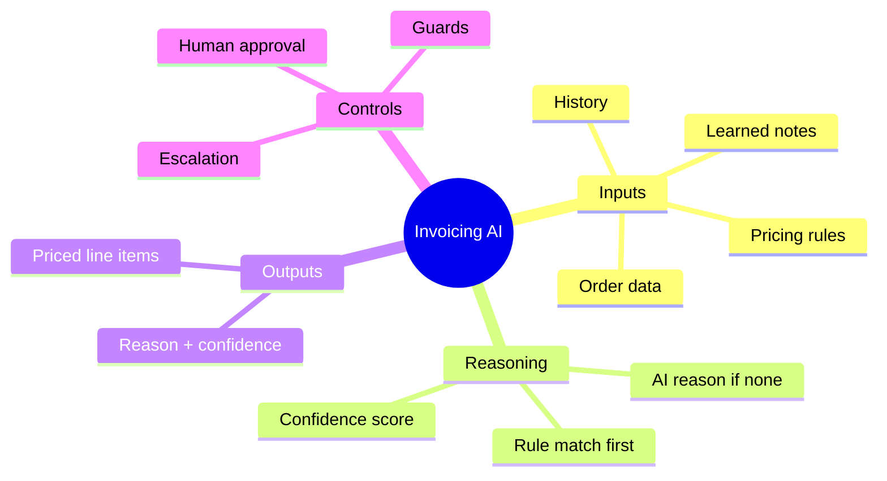
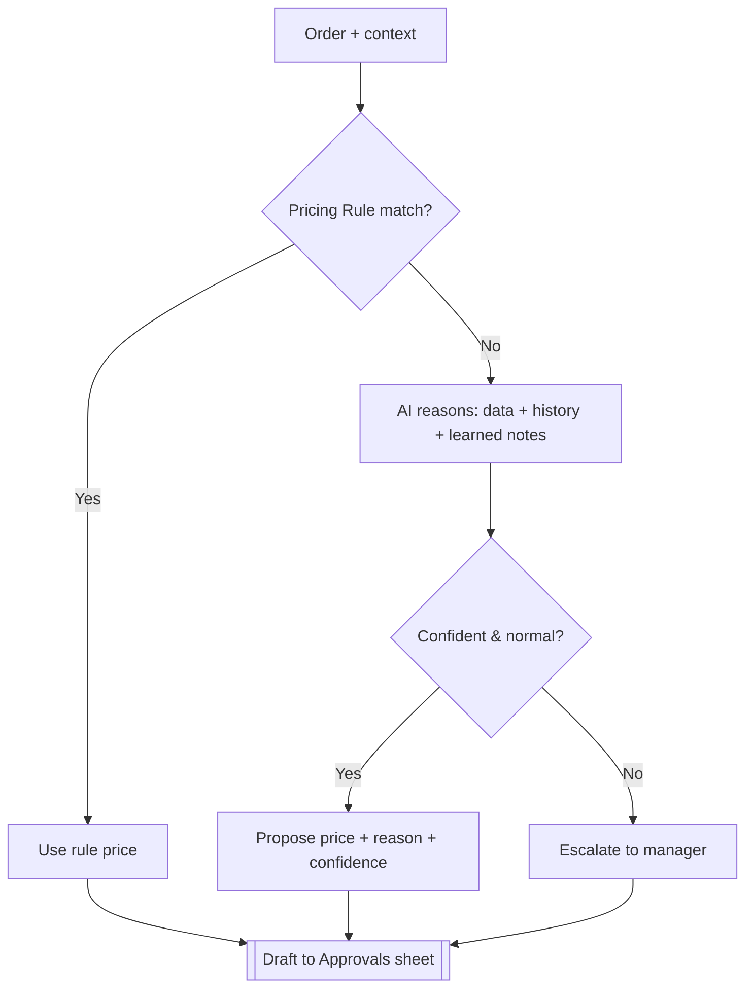
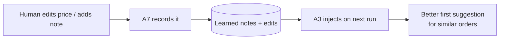

# AI Engineering Guide

| Field | Value |
|---|---|
| **Project** | FTF – Survey Invoicing & Billing Delivery (E2E) · **Client** NexGen Surveying / FTF |
| **Document** | AI Engineering Guide (Brain · Prompts · Guardrails · Model · Learning) · **Version** 1.0 · **Status** Internal |
| **Prepared by** | Tisko Tech · **Owner** Prateek Chandra · **Updated** 2026-07-16 |
| **Audience** | AI engineering, developers, QA |

> **Internal.** Describes prompt *strategy* and guardrails. Full prompt text is not
> reproduced here (kept in code). No secrets.

## Table of Contents
1. Purpose & Scope
2. AI Brain (what the AI does)
3. Model selection & comparison
4. Reasoning pipeline
5. Prompt engineering strategy + version history
6. Tool calling strategy
7. Memory & learning architecture
8. Guardrails & hallucination prevention
9. Confidence, escalation & fallback
10. Evaluation & monitoring
11. Token & latency optimization
12. AI testing strategy
13. Approval & Revision History

---

## 1. Purpose & Scope
How the AI reasons about pricing, how it is kept safe and accurate, and how it learns.
Scope = pricing/reasoning inside A3, learning in A7, and the guardrails across the pipeline.

## 2. AI Brain

**Purpose:** turn an order into a fair, explained price so a human only checks it.

## 3. Model selection & comparison

| Use | Model | Rate /MTok (in/out) | Why |
|---|---|---|---|
| **Production (run)** | **Claude Sonnet 4.6** | $3 / $15 | Fast, cheap, strong enough for structured pricing; no caching needed |
| **Development (build)** | **Claude Opus 4.8** | $15 / $75 (cache-write $18.75, cache-read $1.50) | Deep reasoning for engineering the system |

Sonnet in production keeps per-order cost < $1. Opus was used only to build.

## 4. Reasoning pipeline

## 5. Prompt engineering strategy + version history
- **Grounded prompts:** the model is given only real order data + rules + learned notes;
  it is instructed to price and explain, not to invent orders/clients.
- **Structured output:** line items with `name`, `description`, `amount`; a short reason;
  a confidence label.
- **Learned-rule injection (A3):** learned notes are injected with an explicit instruction
  to *"apply the SAME logic to any SIMILAR order (same client, same/related service, or
  neighbouring county)."*

| Prompt version | Change |
|---|---|
| v(prior) | Base pricing prompt (rules + reasoning + confidence) |
| v(current) | Strengthened learned-rule injection to generalize to similar orders |

## 6. Tool calling strategy
The pipeline is **deterministic code around the model** — the model prices; code does the
side effects (DB read, sheet write, invoice create, email). This keeps every external
action auditable and gated. The model does **not** directly call FTF or send email.

## 7. Memory & learning architecture

- **Sources:** the "Learning provided by user" column (read **every run**) and observed edits.
- **Scope of a lesson:** the specific order **and** similar orders (BR-L2).
- **Additive only:** learning never bypasses approval.

## 8. Guardrails & hallucination prevention

| Guardrail | Mechanism |
|---|---|
| No invented orders/clients | Model works only from real FTF rows |
| No auto-send | Human approval gate (A4) before any create/email |
| Duplicate | Re-check FTF before creating |
| Condo / canceled / delivered | Detected → flagged, never billed |
| Deterministic totals | Col-G `Name: $Amount` summed in code, not by the model |
| Unusual job | Escalate instead of guess |

## 9. Confidence, escalation & fallback

| Confidence | Meaning | Action |
|---|---|---|
| 🟢 High | Clear rule/history | Quick check, approve |
| 🟡 Medium | Reasonable, verify | Review price |
| 🔴 Low / Escalate | Unusual / thin data | Manager reviews |

**Fallback:** if the model can't price confidently, the order is escalated (not auto-priced)
and still surfaces on the sheet for a human.

## 10. Evaluation & monitoring
- **Monitoring:** twice-daily Teams report shows pipeline snapshot + activity + by-whom.
- **Evaluation signal:** approve-without-edit rate, edit deltas, escalation rate, missed-flag rate (target ~0).
- **Health checks:** `pipeline_health_check.py` (stuck sets), `export_pipeline_json.py` (status funnel).

## 11. Token & latency optimization
- Single lean model (Sonnet 4.6) in production; **no cache** needed at this volume.
- Prompts carry only the fields needed to price → low input tokens.
- Measured production cost ≈ **$50.02 total** (~$26/mo, ~$0.70/order).

## 12. AI testing strategy
- Golden orders with known correct prices (rule + non-rule).
- Guard tests: condo/canceled/duplicate must never bill.
- Learning test: add a note → verify next similar order reprices.
- Approval-gate test: blank/On-hold/Reject must never create or email.

---
**Approval**

| Name | Role | Decision | Date |
|---|---|---|---|
|  | AI engineering lead | ☐ Approve |  |

**Revision history** — 1.0 (2026-07-16, Tisko Tech): initial.
