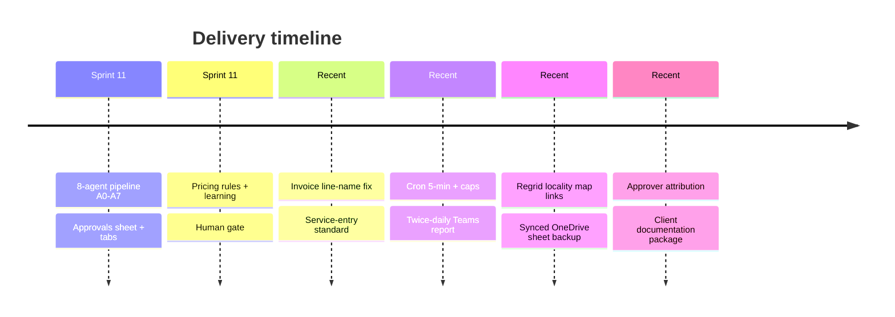

# Development & Release Tracker

| Field | Value |
|---|---|
| **Project** | FTF – Survey Invoicing & Billing Delivery (E2E) · **Client** NexGen Surveying / FTF |
| **Document** | Development & Release Tracker (Sprint · Modules · Build · Releases) · **Version** 1.0 · **Status** Internal |
| **Prepared by** | Tisko Tech · **Owner** Prateek Chandra · **Updated** 2026-07-16 |
| **Audience** | Dev team, PMO |

## Table of Contents
1. Purpose & Scope
2. Sprint plan
3. Module / feature tracker
4. Build tracker
5. Release notes
6. Git reconciliation (honest counts)
7. Approval & Revision History

---

## 1. Purpose & Scope
Track what was built, module state, and releases. Numbers are reconciled against git;
where a tracker under-records git, this doc says so.

## 2. Sprint plan

## 3. Module / feature tracker

| Module | State | Notes |
|---|---|---|
| A0 Orchestrator | ✅ Done | run caps 100/30/30 |
| A1 Flag hunter | ✅ Done | `ng_invoice_needed` + watermark |
| A2 Data collector | ✅ Done | address/lot/county/flood/service |
| A3 Invoice compiler + pricing | ✅ Done | learned-rule injection strengthened |
| A4 Human gate | ✅ Done | reads Action + real approver |
| A5 Finalizer | ✅ Done | line-label fallback fix |
| A6 Sender | ✅ Done | FTF invoice + client email |
| A7 Feedback learner | ✅ Done | reads Learning col each run |
| Approvals sheet + Guide/How-To/Pricing tabs | ✅ Done | v15 / v8 |
| Action dropdown (col O) | ✅ Done | O2:O10000 |
| Twice-daily Teams report | ✅ Done | 12 & 19 ET, activity + by-whom |
| Approver attribution | ✅ Done | Graph activities feed |
| Client documentation package | ✅ Done | 13 docs + PDF |
| Internal documentation package | ✅ In progress | this set |

## 4. Build tracker

| Feature | Files touched | Result |
|---|---|---|
| Invoice line name | `agent_a5_invoice_finalizer.py` | name→desc→"Survey Service" |
| Learn similar orders | `agent_a3_invoice_compiler.py` | generalize to similar orders |
| Sheet tabs + standard + cadence | `onedrive_excel_client.py` | Guide v16 / How-To v9; "5 min"; monitoring |
| Col-F Regrid locality map link | `agent_a3_invoice_compiler.py` | `/us/{state}/{county}/{city}?query=…` (new orders only) |
| Synced sheet backup + URL | `backup_sheet.py`, `onedrive_excel_client.py` | local rolling copies + OneDrive backup file w/ org share link |
| Get-all helper | `excel_db.py` | `get_all_orders()` |
| Twice-daily report | `daily_report.py`, `run_server_daily_report.sh` | activity block + labels + guard |
| Real approver | `run_excel_watcher.py`, `agent_a4_human_gate_v2.py` | `INPUT_APPROVER` → `approved_by` |
| Seed test orders | `scripts/seed_specific_orders.py` | 10 orders |

## 5. Release notes (recent commits to `main`)

| Commit | Summary |
|---|---|
| 9886958d | Fix invoice line name + strengthen operator learning + document col-G standard |
| fa6e005f | Add `seed_specific_orders.py` — bring an explicit set of order IDs to the sheet |
| de906d34 | Twice-daily Teams monitoring report (12 PM & 7 PM ET) with activity/audit |
| 9cb3afe0 | Fix remaining stale "30 min" cadence text in Guide/How-To tabs |
| 1d98952e | Attribute approvals to the real human editor (Sumit/Prateek), not hard-coded name |

## 6. Git reconciliation (honest counts)
- Repo history is large (**~6,621 commits**), **0 version tags** — releases are tracked by
  **feature commits**, not semantic tags. Any release number here is derived from commit
  subjects, not tags. This is stated so no one over-reads a "version count".

---
**Approval**

| Name | Role | Decision | Date |
|---|---|---|---|
|  | Dev manager | ☐ Approve |  |

**Revision history** — 1.0 (2026-07-16, Tisko Tech): initial.
