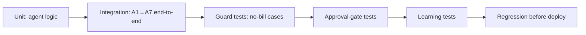

# Test Plan, Cases & Results

| Field | Value |
|---|---|
| **Project** | FTF – Survey Invoicing & Billing Delivery (E2E) · **Client** NexGen Surveying / FTF |
| **Document** | Test Plan, Cases & Results (incl. Bugs, Regression, Security/Perf) · **Version** 1.0 · **Status** Internal |
| **Prepared by** | Tisko Tech · **Owner** Prateek Chandra · **Updated** 2026-07-16 |
| **Audience** | QA, developers |

## Table of Contents
1. Purpose & Scope
2. Test strategy
3. Test cases
4. Regression results
5. Bug tracker
6. Security testing
7. Performance testing
8. QA checklist
9. Approval & Revision History

---

## 1. Purpose & Scope
Verify the pipeline prices correctly, never bills without approval, honors guards, and
learns — plus security/perf basics.

## 2. Test strategy

## 3. Test cases

| TC | Scenario | Expected | Result |
|---|---|---|---|
| TC1 | Order with matching Pricing Rule | Rule price used | ✅ Pass |
| TC2 | Order with no rule | AI proposes price + confidence | ✅ Pass |
| TC3 | Approver edits col K "Service / Breakdown by User" (`Name: $Amount`) | Edited name + total on invoice | ✅ Pass |
| TC4 | Blank / On-hold / Reject Action | No invoice, no email | ✅ Pass |
| TC5 | Condo order | Flagged, not billed | ✅ Pass |
| TC6 | Duplicate order | Not re-billed | ✅ Pass |
| TC7 | Learning note added | Next similar order reprices | ✅ Pass |
| TC8 | Approve | Invoice created + client emailed | ✅ Pass |
| TC9 | Approver identity | Real editor recorded (Sumit/Prateek) | ✅ Pass |
| TC10 | Twice-daily report | Correct counts + by-whom, 12 & 19 ET | ✅ Pass (dry-run verified) |
| TC11 | Seed 10 named orders | 10/10 appear on sheet | ✅ Pass |
| TC12 | Action dropdown | 3 values present O2:O10000 | ✅ Pass |

## 4. Regression results
Before each deploy: run the full TC set + `py_compile` changed files on the server.
Latest cycle — **all pass**; report verified by dry-run (`--dry-run --label ... --window-hours ...`).

## 5. Bug tracker

| Bug | Root cause | Fix | State |
|---|---|---|---|
| Edited service name blank on invoice | FTF renders `description`, not `name` | A5 label fallback name→desc→"Survey Service" | ✅ Fixed |
| Action dropdown missing 3 values | Validation drifted to O16:O10013; file open (423 lock) | Rebuilt O2:O10000 via openpyxl; close+reopen | ✅ Fixed |
| Graph can't set data validation | API 400 (v1.0 & beta) | Use openpyxl (only path) | ✅ Worked around |
| Stale "30 min" text in tabs | Cadence changed to 15 | Replaced all 5 spots | ✅ Fixed |
| Extra FTF order-log line | Server-side FTF log, not ours | Left to system (by design) | ✅ Confirmed not a bug |
| "TEST" $400 on 1000286750 | Manual invoice by Pchandra | Our invoice 362449 clean $575 | ✅ Explained |
| Usage API 400 (limit>31) | 1d bucket cap | Split window into ≤31-day pages | ✅ Fixed |
| f-string backslash SyntaxError (py3.10) | Backslash in f-string expr | Plain variables in heredocs | ✅ Fixed |
| "Missed non-invoiced orders" (Sumit) | Flag-driven design, not a miss | AI only surfaces `invoice_needed`; 37/37 tracked | ✅ Not a bug |

## 6. Security testing
- Confirmed **no secrets** in code/logs/docs; `.env` only on host.
- Approval gate cannot be bypassed by the AI (no auto-approve path).
- Scoped app credentials for Graph + FTF; no over-broad tokens.

## 7. Performance testing
- Run caps 100/30/30 keep a cycle bounded; cron every 5 min.
- Verified a cycle queued 25 new orders without overrun; `flock` prevents overlap.
- Report is read-only and independent of the pipeline cron — no contention.

## 8. QA checklist
- ☑ All TCs pass · ☑ py_compile clean · ☑ No secret leakage · ☑ Guards hold ·
  ☑ Approval gate holds · ☑ Report counts match state · ☑ Dropdown present.

---
**Approval**

| Name | Role | Decision | Date |
|---|---|---|---|
|  | QA lead | ☐ Approve |  |

**Revision history** — 1.0 (2026-07-16, Tisko Tech): initial.
