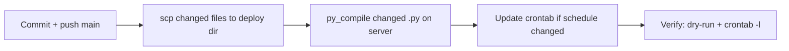
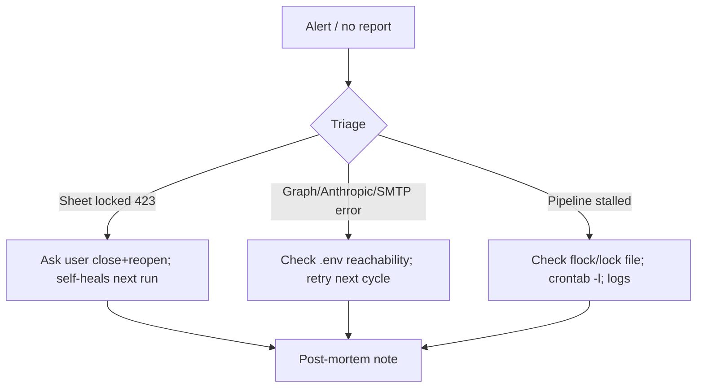

# Operations Runbook

| Field | Value |
|---|---|
| **Project** | FTF – Survey Invoicing & Billing Delivery (E2E) · **Client** NexGen Surveying / FTF |
| **Document** | Operations Runbook (Deploy · Monitor · Incident · Backup · DR · SOPs) · **Version** 1.0 · **Status** Internal |
| **Prepared by** | Tisko Tech · **Owner** Prateek Chandra · **Updated** 2026-07-16 |
| **Audience** | DevOps, on-call, ops |

> **Internal.** Host paths and schedules included. No secrets/keys.

## Table of Contents
1. Purpose & Scope
2. Deployment runbook
3. Scheduling (cron)
4. Monitoring guide
5. Incident response
6. Backup & recovery
7. Disaster recovery
8. SOPs
9. Approval & Revision History

---

## 1. Purpose & Scope
How to deploy, watch, and recover the pipeline. Host = EC2; deploy dir
`/home/ubuntu/FTF Invoicing Agent`; runtime `.venv/bin/python` (3.10).

## 2. Deployment runbook

**Steps**
1. Commit to `main`, push (PAT).
2. `scp` changed files into `/home/ubuntu/FTF Invoicing Agent` (preserve paths).
   - Cron calls the `/home/ubuntu/ftf-invoicing-*.sh` wrappers (symlinks to `scripts/run_server_pipeline.sh`, `run_server_watcher.sh`, `run_server_daily_report.sh`).
3. `.venv/bin/python -m py_compile <changed>.py`.
4. Update crontab only if schedule changed; back up crontab to `/tmp` first.
5. Verify (below).

## 3. Scheduling (cron) — live

| Job (crontab entry) | Schedule | Purpose |
|---|---|---|
| `ftf-invoicing-run.sh` → `run_server_pipeline.sh` | `*/5 * * * *` | Pipeline run (A0→A3 intake + backstop). Caps: A1=100 / A2=30 / A3 batch=30. Shares the flock lock with the watcher (both */5). |
| `ftf-invoicing-watch.sh` → `run_server_watcher.sh` | every 5 min | Approval watcher (A4→A5→A6) / self-heal |
| `ftf-invoicing-report.sh` → `run_server_daily_report.sh` | `0 16,17,23,0 * * *` UTC | Teams report; ET-hour guard fires only at 12 & 19 ET |

All guarded by `flock` (no overlap). Wrappers set `TZ=America/New_York`; the report wrapper
exits unless the ET hour ∈ {12,19}.

## 4. Monitoring guide
- **Primary:** twice-daily Teams report (snapshot + activity + by-whom).
- **On demand:** `pipeline_health_check.py` (stuck sets), `export_pipeline_json.py` (funnel).
- **Green signals:** new orders queued each cycle; approvals flowing; ~0 missed flags.
- **Watch for:** file-lock (423) on the sheet, Graph/Anthropic/SMTP errors in logs.

## 5. Incident response

- **Safety:** the human gate means a stall never causes a wrong bill — worst case is delay.
- Escalate to delivery lead if unresolved in one cycle.

## 6. Backup & recovery
- **Source of truth for orders/invoices = FTF** (external, backed up by FTF).
- **State store** (Excel + `pipeline_state`) is rebuildable from FTF flags; a lost run
  re-detects flagged orders next cycle.
- **Sheet backup (`scripts/backup_sheet.py`, every cycle):** downloads the full OneDrive
  workbook (all tabs) to `<deploy>/backups/` (`latest.xlsx` + rolling snapshots, newest
  `SHEET_BACKUP_KEEP`=48 kept) **and** mirrors it to a separate OneDrive file
  `FTF-Invoicing Agent BACKUP.xlsx` with an **organization share link** (written to
  `backups/BACKUP_URL.txt`). Read-only w.r.t. the live sheet — never edits/removes an order.
- Back up crontab before edits (`crontab -l > /tmp/cron.bak`).

## 7. Disaster recovery
- Host loss: redeploy code to a fresh host, restore `.env`, re-add crontab; pipeline
  re-detects flagged orders. **RPO** ≈ one cycle (5 min); **RTO** = redeploy time.
- No irreplaceable local data — FTF holds the authoritative records.

## 8. SOPs
- **Change cadence:** edit the crontab entry for `ftf-invoicing-run.sh`, back up first (`crontab -l > /tmp/cron.bak`), verify with `crontab -l`.
- **Add a pricing rule:** append a row in the Pricing Rules tab (no deploy).
- **Teach the AI:** note in "Learning provided by user".
- **Never:** write FTF order-log lines by hand; approve/send on the client's behalf.

---
**Approval**

| Name | Role | Decision | Date |
|---|---|---|---|
|  | DevOps / Ops | ☐ Approve |  |

**Revision history** — 1.0 (2026-07-16, Tisko Tech): initial.
