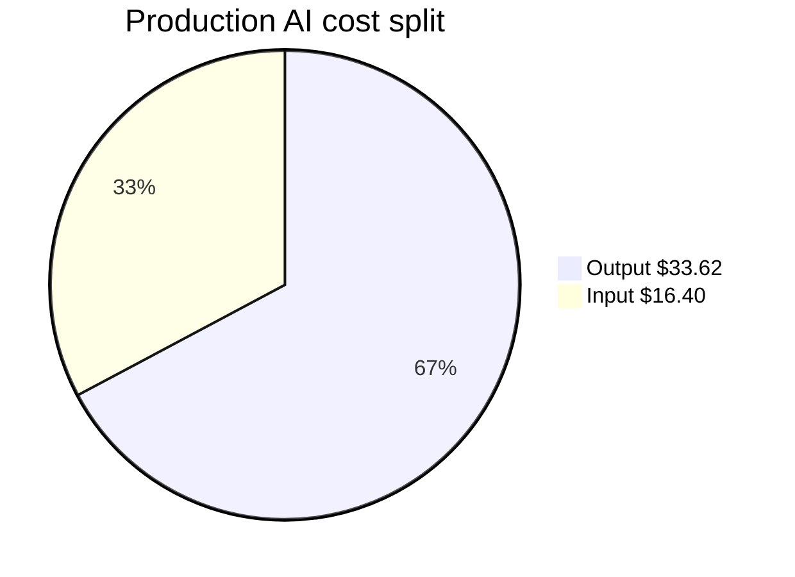
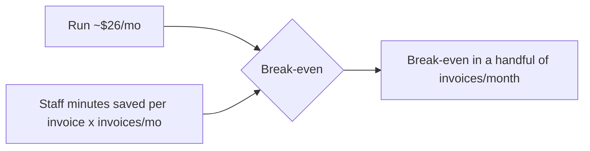

# Finance, Cost & Profitability Dashboard

| Field | Value |
|---|---|
| **Project** | FTF – Survey Invoicing & Billing Delivery (E2E) · **Client** NexGen Surveying / FTF |
| **Document** | Finance, Cost & Profitability Dashboard · **Version** 1.0 · **Status** Internal |
| **Prepared by** | Tisko Tech · **Owner** Prateek Chandra · **Updated** 2026-07-16 |
| **Audience** | Finance, delivery lead, executives |
| **Measurement window** | 2026-05-20 → 2026-07-17 (~1.9 months) |

> **Internal.** Contains cost/margin detail NOT shared with the client. All figures
> **measured** (Admin API / transcripts / git) — none estimated. No secrets.

## Table of Contents
1. Purpose & Scope
2. Executive summary (the numbers)
3. AI cost dashboard (production)
4. Development (build) cost
5. Infrastructure, licensing & vendors
6. Profitability & pricing guidance
7. ROI & break-even
8. Provenance & confidence
9. Approval & Revision History

---

## 1. Purpose & Scope
The internal money view: what the AI costs to run, what it cost to build, other costs,
and margin/pricing guidance. Client-facing ROI lives in the client `AI_Cost_Pricing_and_ROI`
doc — this internal version adds margin and pricing that the client does not see.

## 2. Executive summary

| Metric | Value | Confidence |
|---|---|---|
| **Production run cost (to date)** | **$50.02** (~**$26/mo**) | High (key-isolated) |
| **Cost per order (run)** | **~$0.72** | Illustrative (÷ ~69 tracked) |
| **Development (build) value** | **$385.74** (local sessions) | Measured; partial scope |
| **Infra / licensing** | see §5 | `[CLIENT INPUT REQUIRED]` for exact host bill |

## 3. AI cost dashboard (production) — MEASURED

Source: Anthropic **Admin Usage API**, filtered to the `FTF-Invoicing Agent` key.
Model **Claude Sonnet 4.6**; no cached tokens.

| Item | Tokens | Rate /MTok | Cost |
|---|---|---|---|
| Input | 5,467,559 | $3 | $16.40 |
| Output | 2,241,239 | $15 | $33.62 |
| **Total** |  |  | **$50.02** |

- Monthly run rate ≈ **$26/mo**; annualized ≈ **$312/yr** at current volume.
- Per order ≈ **$0.72** ($50 ÷ ~69 orders; illustrative).

## 4. Development (build) cost — MEASURED (local sessions)

Source: this project's Claude Code transcripts, deduped by `message.id`, model **Opus 4.8**.

| Item | Tokens | Rate /MTok | Cost |
|---|---|---|---|
| Input | 13,300 | $15 | $0.20 |
| Output | 629,125 | $75 | $47.18 |
| Cache write | 8,680,345 | $18.75 | $162.76 |
| Cache read | 117,063,738 | $1.50 | $175.60 |
| **Total** |  |  | **$385.74** |

> ⚠️ Only the **locally-retained** transcript is captured (one session file). Exact for
> those sessions; **true multi-month build cost is higher** and not fully measurable here.
> This is a list-rate **value**, not an invoice.

## 5. Infrastructure, licensing & vendors

| Item | Vendor | Cost basis | Notes |
|---|---|---|---|
| Compute (EC2 host) | AWS | monthly instance | `[CLIENT INPUT REQUIRED]` — exact instance/bill |
| AI model | Anthropic | usage (above) | Sonnet 4.6 prod |
| Microsoft 365 / Graph | Microsoft | existing client license | OneDrive Excel + Teams |
| Power Automate flow | Microsoft | existing plan | Teams delivery |
| Email (SMTP) | client mail | existing | Client invoicing email |

Most platforms reuse the client's **existing** M365 licensing → low incremental cost.
The only clearly new recurring cost is **AI (~$26/mo)** + the host instance.

## 6. Profitability & pricing guidance (internal only)

| Lever | Note |
|---|---|
| Run cost/order | ~$0.72 — negligible vs invoice value |
| Suggested client pricing | flat monthly managed fee + optional per-order — sized to value, not cost |
| Margin driver | run cost is a rounding error; margin ≈ managed fee − (AI + host) |
| Enterprise/scale | cost scales ~linearly with orders; Sonnet keeps unit cost flat |

> `[CLIENT INPUT REQUIRED]` — target managed-service fee and support SLA to finalize margin.

## 7. ROI & break-even

`[CLIENT INPUT REQUIRED]` — staff minutes per manual invoice and invoices/month convert
time-saved into a dollar ROI + payback period.

## 8. Provenance & confidence
- **Production:** `/usage_report/messages` filtered by `api_key_id`, priced at list rates — **high confidence**.
- **Development:** local `~/.claude/projects/<slug>/*.jsonl`, deduped by `message.id` — **measured, partial scope**.
- **Releases:** git shows ~6,621 commits / **0 tags** — releases tracked by feature commits.
- No figure estimated; scope strictly this project.

---
**Approval**

| Name | Role | Decision | Date |
|---|---|---|---|
|  | Finance / Delivery lead | ☐ Approve |  |

**Revision history** — 1.0 (2026-07-16, Tisko Tech): initial with measured production + dev cost.
