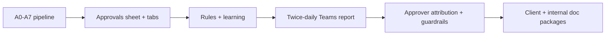

# Lessons Learned & Internal Closeout

| Field | Value |
|---|---|
| **Project** | FTF – Survey Invoicing & Billing Delivery (E2E) · **Client** NexGen Surveying / FTF |
| **Document** | Lessons Learned & Internal Closeout · **Version** 1.0 · **Status** Internal |
| **Prepared by** | Tisko Tech · **Owner** Prateek Chandra · **Updated** 2026-07-16 |
| **Audience** | Delivery team, PMO |

## Table of Contents
1. Purpose & Scope
2. What was delivered
3. Lessons learned
4. What went well / what to improve
5. Technical debt & follow-ups
6. Closeout checklist
7. Approval & Revision History

---

## 1. Purpose & Scope
Capture the internal retrospective and confirm delivery closeout for this phase.

## 2. What was delivered

## 3. Lessons learned

| What we learned | Action taken |
|---|---|
| FTF invoice renders `description`, not `name` | A5 label fallback name→desc→"Survey Service" |
| Excel Online caches an open file (423 lock) | Self-heal next run; guide close+reopen |
| Graph cannot set data validation | Use openpyxl for the Action dropdown |
| Approver identity isn't per-cell in Graph | Attribute via activities feed |
| The AI is only as complete as FTF's flag | Documented; option to broaden intake |
| py3.10 f-string backslash breaks in heredocs | Build strings with plain variables |
| Cost must be isolated by API key | Usage API filtered by `api_key_id` is authoritative |
| "Missed orders" was flag-driven, not a bug | Explained to client; 37/37 tracked |
| Let the system own its own logs | Removed our extra FTF order-log line |

## 4. What went well / what to improve

| ✅ Went well | 🔧 Improve |
|---|---|
| Human gate kept every side effect safe | Durable per-user audit log (deferred) |
| Deterministic report block (no hallucinated counts) | Broaden intake beyond `invoice_needed` (optional) |
| Measured, honest cost reporting | True editable `.docx` output (needs pandoc) |
| Learning generalizes to similar orders | Automated golden-order eval harness |

## 5. Technical debt & follow-ups
- Per-user audit log beyond the on-record approver — **deferred** (activities feed used instead).
- True editable Word `.docx` — needs a one-time `pandoc` install (PDF delivered via Edge).
- ROI dollarization pending `[CLIENT INPUT REQUIRED]` staff-time inputs.
- Optional: `03_Project_Assets` folder (branding, sample data, prompt library) not yet populated.

## 6. Closeout checklist

| Item | Done? |
|---|---|
| Pipeline delivered + deployed (5-min cron) | ☑ |
| Client documentation package | ☑ |
| Internal documentation package | ☑ |
| Measured cost recorded | ☑ |
| UAT sign-off (client) | ☐ `[CLIENT INPUT REQUIRED]` |
| Support model agreed | ☐ `[CLIENT INPUT REQUIRED]` |

---
**Sign-off**

| Name | Role | Decision | Date |
|---|---|---|---|
|  | Delivery lead | ☐ Accept |  |

**Revision history** — 1.0 (2026-07-16, Tisko Tech): initial internal closeout.
